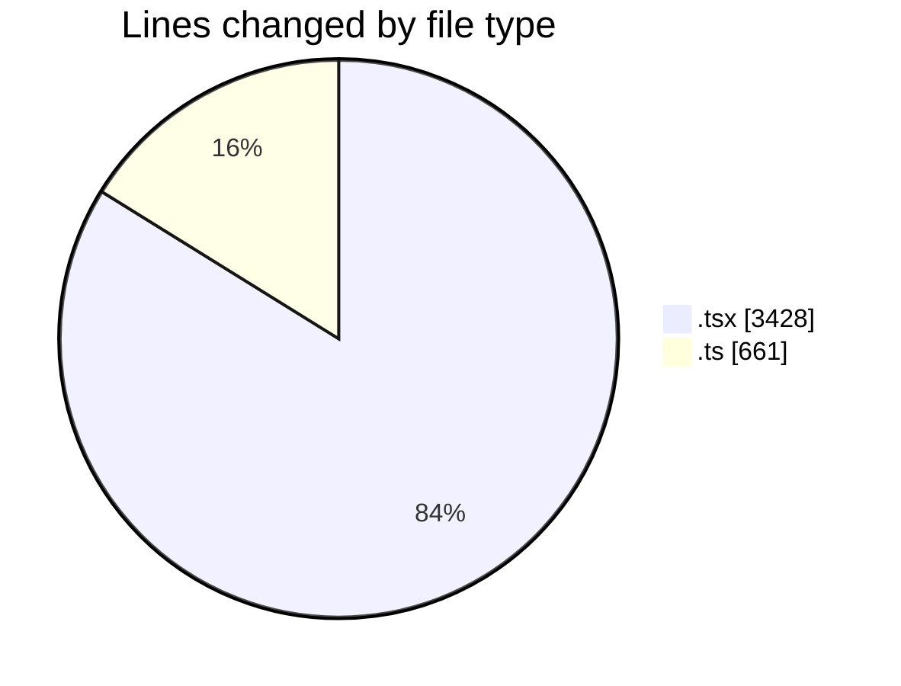
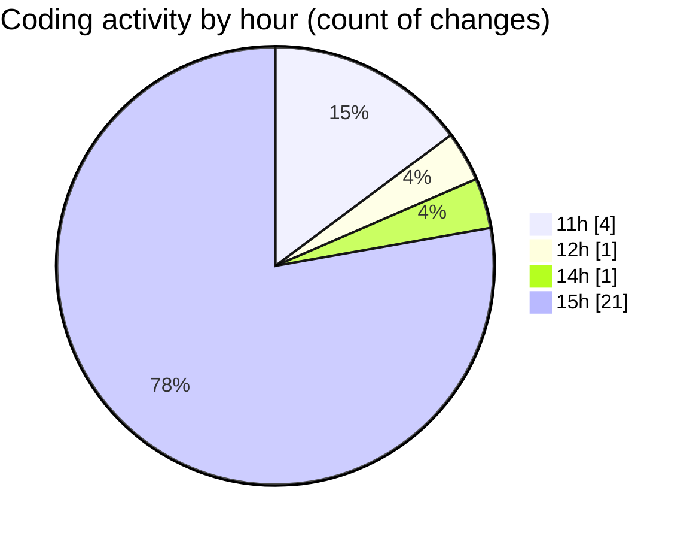

# nxtqube_webapp - Activity Summary 

## Overall Statistics

| Stat                   | Value                                                             |
| ---------------------- | ----------------------------------------------------------------- |
| **Lines Added** (➕)   | 4046                                          |
| **Lines Removed** (➖) | 43                                        |
| **Net Change** (↕)    | 4003                |
| **Active Time** (⌚)   | 24 minutes |

## Modified Files
- **WaypointAction.tsx** (+987, -0)
- **annotation.create.tsx** (+1223, -0)
- **CreateCustumeFlink.tsx** (+119, -0)
- **MissionControl.tsx** (+1057, -0)
- **createPathMission.tsx** (+15, -27)
- **mission.validator.ts** (+645, -16)

## Visualizations

### By File Type (Lines Changed)

### By Hour (Estimated Activity Count)

> **Last Updated:** 08/06/2026, 15:34:59