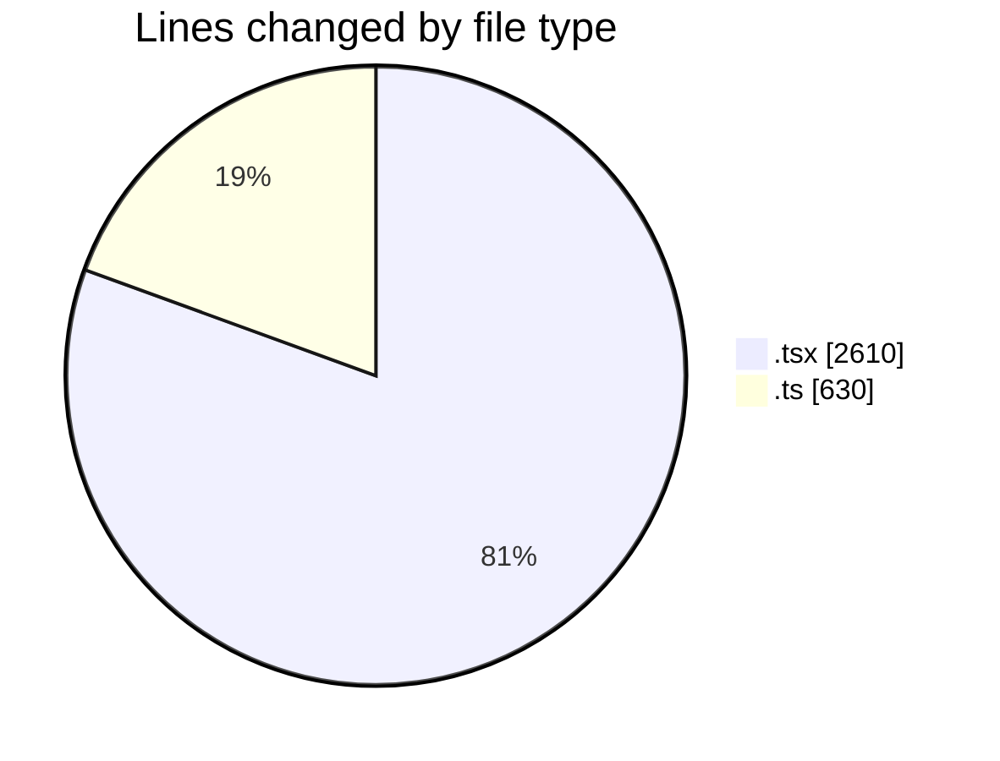
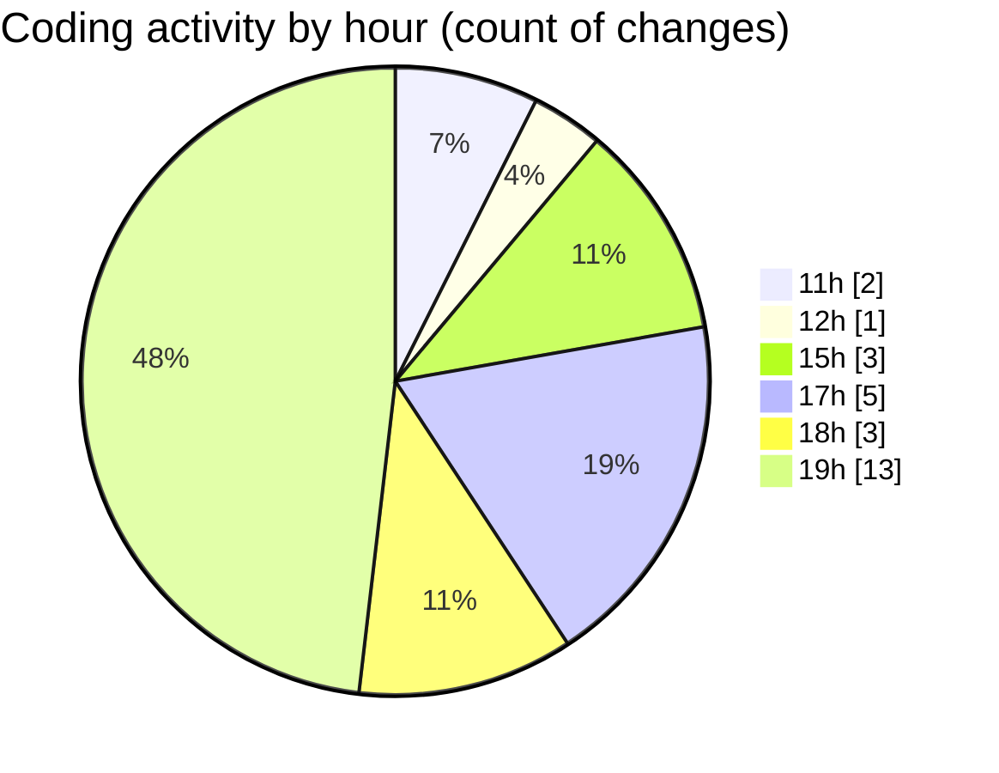

# nxtqube_webapp - Activity Summary 

## Overall Statistics

| Stat                   | Value                                                             |
| ---------------------- | ----------------------------------------------------------------- |
| **Lines Added** (➕)   | 2517                                          |
| **Lines Removed** (➖) | 723                                        |
| **Net Change** (↕)    | 1794                |
| **Active Time** (⌚)   | 34 minutes |

## Modified Files
- **geofence.card.tsx** (+566, -365)
- **ExistingMission.tsx** (+1039, -352)
- **ReusableCard.tsx** (+282, -6)
- **mission.validator.ts** (+630, -0)

## Visualizations

### By File Type (Lines Changed)

### By Hour (Estimated Activity Count)

> **Last Updated:** 15/06/2026, 19:25:26