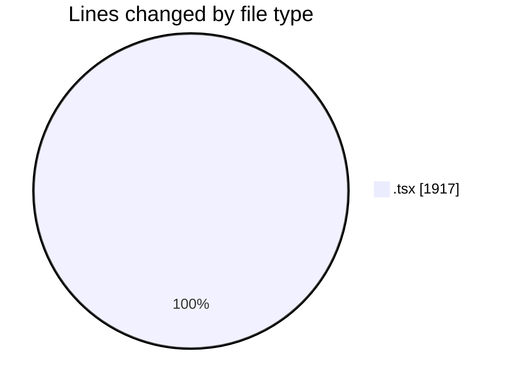
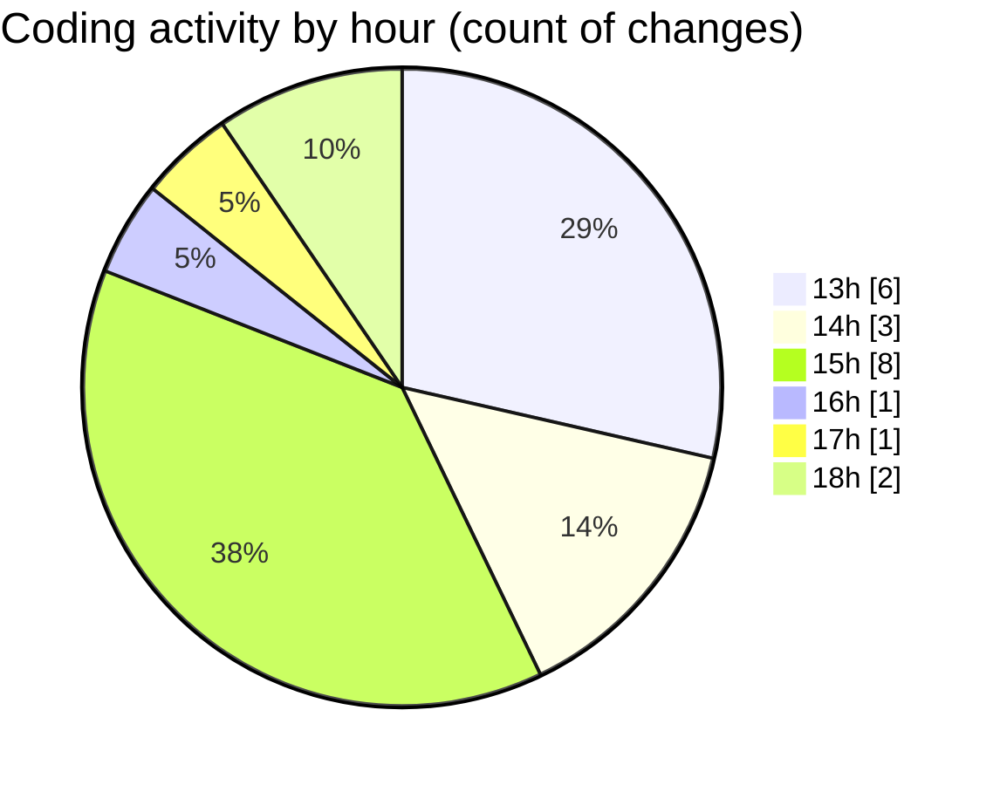

# nxtqube_webapp - Activity Summary 

## Overall Statistics

| Stat                   | Value                                                             |
| ---------------------- | ----------------------------------------------------------------- |
| **Lines Added** (➕)   | 1857                                          |
| **Lines Removed** (➖) | 60                                        |
| **Net Change** (↕)    | 1797                |
| **Active Time** (⌚)   | 27 minutes |

## Modified Files
- **ExistingMission.tsx** (+687, -43)
- **geogence.list.tsx** (+278, -1)
- **Existing.tsx** (+517, -14)
- **paginationUI.tsx** (+109, -0)
- **SortMission.tsx** (+266, -2)

## Visualizations

### By File Type (Lines Changed)

### By Hour (Estimated Activity Count)

> **Last Updated:** 16/06/2026, 18:05:03