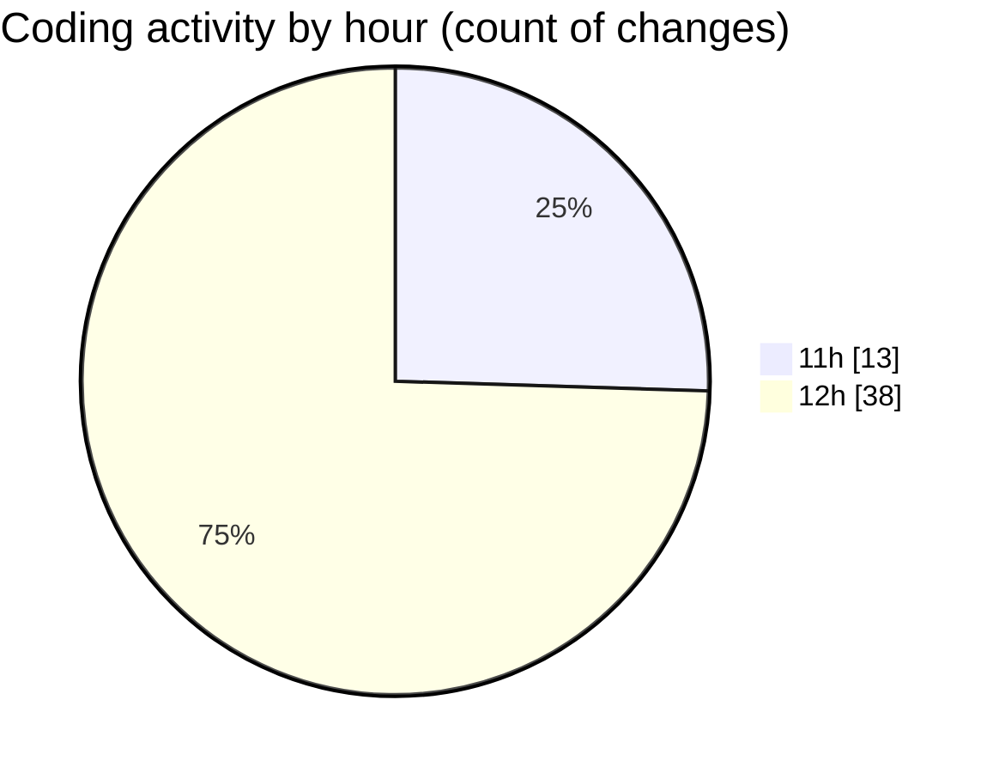

# nxtqube_webapp - Activity Summary 

## Overall Statistics

| Stat                   | Value                                                             |
| ---------------------- | ----------------------------------------------------------------- |
| **Lines Added** (➕)   | 5692                                          |
| **Lines Removed** (➖) | 771                                        |
| **Net Change** (↕)    | 4921                |
| **Active Time** (⌚)   | 53 minutes |

## Modified Files
- **paginationUI.tsx** (+109, -0)
- **SortMission.tsx** (+266, -2)
- **Existing.tsx** (+504, -1)
- **MissionsNav.tsx** (+123, -0)
- **ExistingMission.tsx** (+645, -3)
- **geogence.list.tsx** (+254, -0)
- **OrbitMissionControl.tsx** (+763, -13)
- **StackMissionControl.tsx** (+1535, -185)
- **SettingsSidebar.tsx** (+306, -91)
- **users.create.tsx** (+688, -347)
- **users.list.tsx** (+499, -129)

## Visualizations

### By File Type (Lines Changed)

### By Hour (Estimated Activity Count)

> **Last Updated:** 17/06/2026, 12:12:15