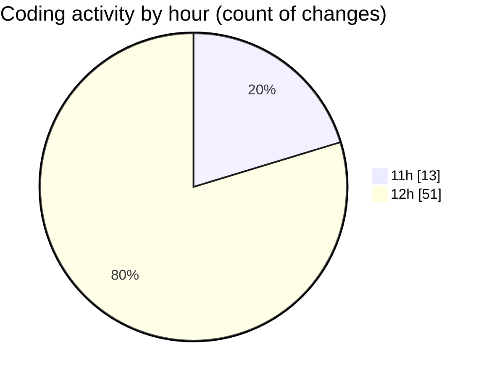

# nxtqube_webapp - Activity Summary 

## Overall Statistics

| Stat                   | Value                                                             |
| ---------------------- | ----------------------------------------------------------------- |
| **Lines Added** (➕)   | 6197                                          |
| **Lines Removed** (➖) | 1160                                        |
| **Net Change** (↕)    | 5037                |
| **Active Time** (⌚)   | 80 minutes |

## Modified Files
- **paginationUI.tsx** (+109, -0)
- **SortMission.tsx** (+266, -2)
- **Existing.tsx** (+504, -1)
- **MissionsNav.tsx** (+123, -0)
- **ExistingMission.tsx** (+647, -3)
- **geogence.list.tsx** (+277, -0)
- **OrbitMissionControl.tsx** (+763, -13)
- **StackMissionControl.tsx** (+1621, -271)
- **SettingsSidebar.tsx** (+381, -166)
- **users.create.tsx** (+817, -476)
- **users.list.tsx** (+580, -210)
- **schedule.header.tsx** (+109, -18)

## Visualizations

### By File Type (Lines Changed)

### By Hour (Estimated Activity Count)

> **Last Updated:** 17/06/2026, 12:17:15