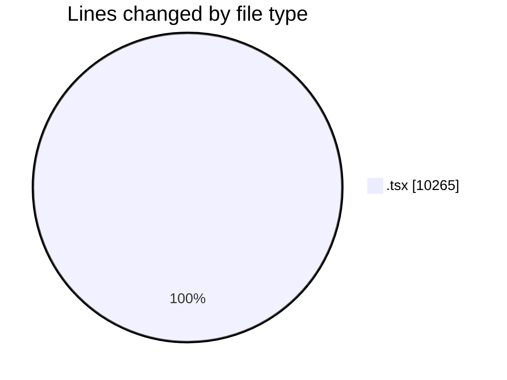
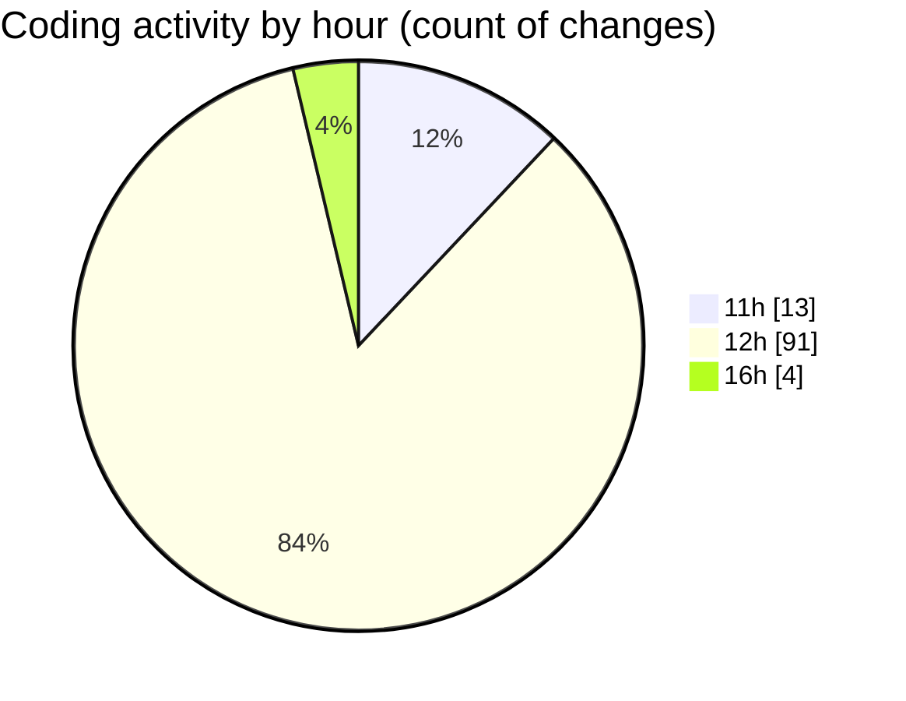

# nxtqube_webapp - Activity Summary 

## Overall Statistics

| Stat                   | Value                                                             |
| ---------------------- | ----------------------------------------------------------------- |
| **Lines Added** (➕)   | 8450                                          |
| **Lines Removed** (➖) | 1815                                        |
| **Net Change** (↕)    | 6635                |
| **Active Time** (⌚)   | 123 minutes |

## Modified Files
- **paginationUI.tsx** (+109, -0)
- **SortMission.tsx** (+266, -2)
- **Existing.tsx** (+504, -1)
- **MissionsNav.tsx** (+123, -0)
- **ExistingMission.tsx** (+651, -7)
- **geogence.list.tsx** (+323, -46)
- **OrbitMissionControl.tsx** (+776, -26)
- **StackMissionControl.tsx** (+1793, -443)
- **SettingsSidebar.tsx** (+389, -174)
- **users.create.tsx** (+929, -588)
- **users.list.tsx** (+678, -308)
- **schedule.header.tsx** (+119, -28)
- **createPathMission.tsx** (+954, -12)
- **user.permissions.dialog.tsx** (+407, -109)
- **createMissionHome.tsx** (+429, -71)

## Visualizations

### By File Type (Lines Changed)

### By Hour (Estimated Activity Count)

> **Last Updated:** 17/06/2026, 16:18:09