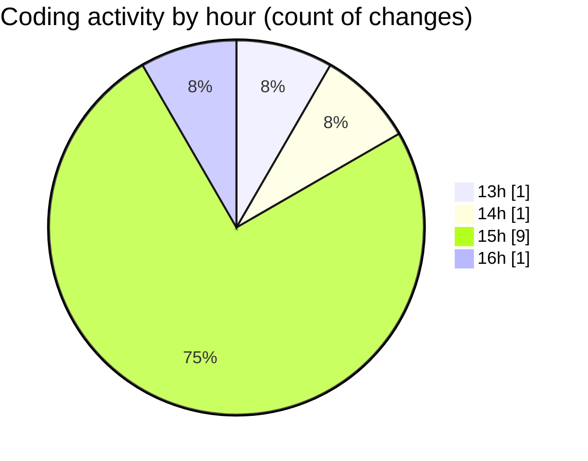

# nxtqube_webapp - Activity Summary 

## Overall Statistics

| Stat                   | Value                                                             |
| ---------------------- | ----------------------------------------------------------------- |
| **Lines Added** (➕)   | 1219                                          |
| **Lines Removed** (➖) | 581                                        |
| **Net Change** (↕)    | 638                |
| **Active Time** (⌚)   | 6 minutes |

## Modified Files
- **DroneInfo.tsx** (+206, -0)
- **DroneList.tsx** (+160, -0)
- **DockCardItem.tsx** (+663, -581)
- **ReusableCard.tsx** (+190, -0)

## Visualizations

### By File Type (Lines Changed)

### By Hour (Estimated Activity Count)

> **Last Updated:** 06/07/2026, 16:10:02