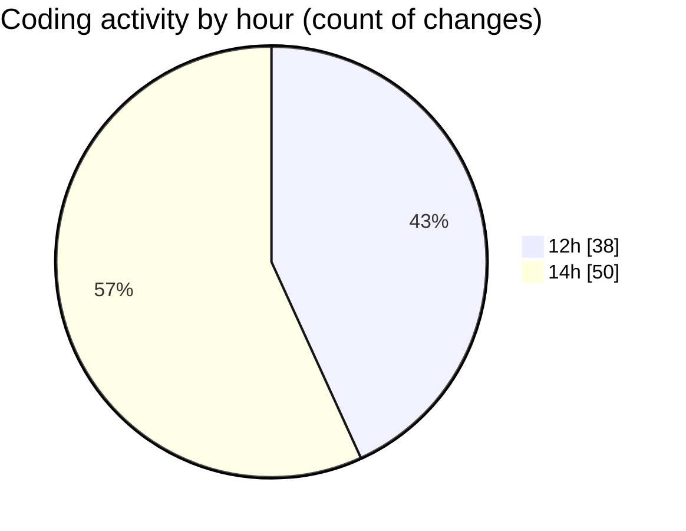

# nxtqube_webapp - Activity Summary 

## Overall Statistics

| Stat                   | Value                                                             |
| ---------------------- | ----------------------------------------------------------------- |
| **Lines Added** (➕)   | 4214                                          |
| **Lines Removed** (➖) | 2435                                        |
| **Net Change** (↕)    | 1779                |
| **Active Time** (⌚)   | 84 minutes |

## Modified Files
- **DockCardItem.tsx** (+72, -54)
- **DroneList.tsx** (+815, -612)
- **create3DMission.tsx** (+92, -69)
- **DockList.tsx** (+87, -91)
- **Multicam.tsx** (+730, -979)
- **DroneInfo.tsx** (+41, -59)
- **Drone.tsx** (+32, -0)
- **SettingsSidebar.tsx** (+310, -37)
- **users.create.tsx** (+465, -115)
- **users.list.tsx** (+468, -98)
- **DockInfo.tsx** (+180, -45)
- **ReusableCard.tsx** (+252, -126)
- **user.permissions.dialog.tsx** (+407, -109)
- **change.password.tsx** (+229, -33)
- **Setting.tsx** (+34, -8)

## Visualizations

### By File Type (Lines Changed)

### By Hour (Estimated Activity Count)

> **Last Updated:** 09/07/2026, 14:12:22