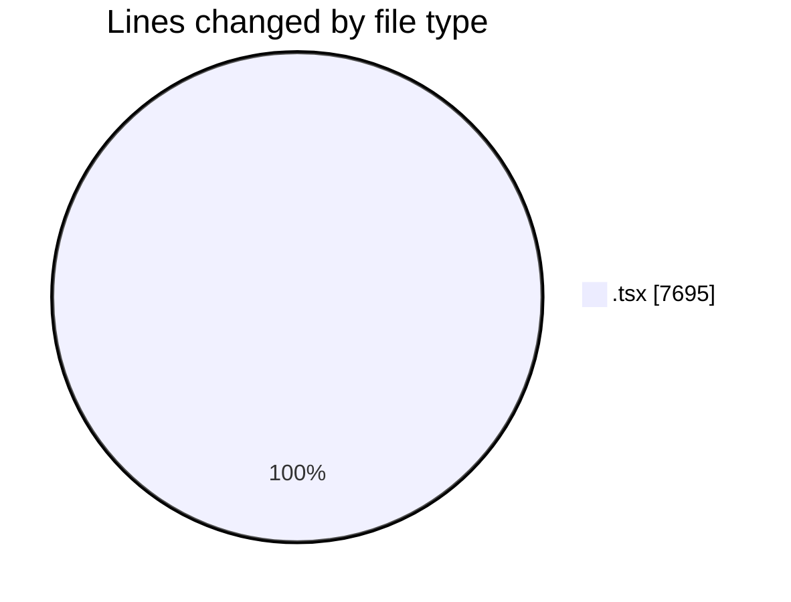
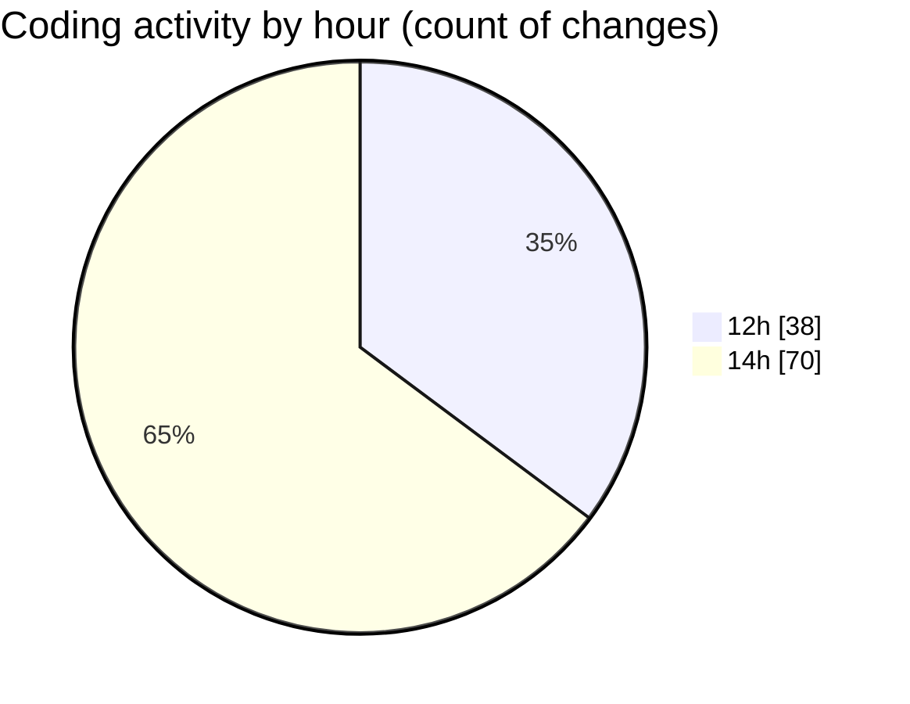

# nxtqube_webapp - Activity Summary 

## Overall Statistics

| Stat                   | Value                                                             |
| ---------------------- | ----------------------------------------------------------------- |
| **Lines Added** (➕)   | 4653                                          |
| **Lines Removed** (➖) | 3042                                        |
| **Net Change** (↕)    | 1611                |
| **Active Time** (⌚)   | 104 minutes |

## Modified Files
- **DockCardItem.tsx** (+72, -72)
- **DroneList.tsx** (+815, -816)
- **create3DMission.tsx** (+92, -92)
- **DockList.tsx** (+94, -94)
- **Multicam.tsx** (+979, -979)
- **DroneInfo.tsx** (+59, -80)
- **Drone.tsx** (+32, -0)
- **SettingsSidebar.tsx** (+310, -37)
- **users.create.tsx** (+475, -126)
- **users.list.tsx** (+468, -98)
- **DockInfo.tsx** (+180, -86)
- **ReusableCard.tsx** (+407, -412)
- **user.permissions.dialog.tsx** (+407, -109)
- **change.password.tsx** (+229, -33)
- **Setting.tsx** (+34, -8)

## Visualizations

### By File Type (Lines Changed)

### By Hour (Estimated Activity Count)

> **Last Updated:** 09/07/2026, 14:17:22