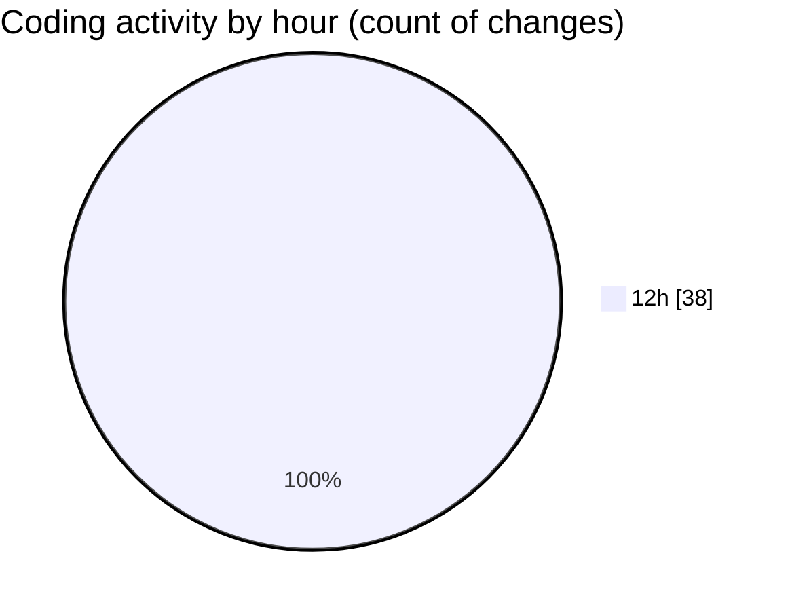

# nxtqube_webapp - Activity Summary 

## Overall Statistics

| Stat                   | Value                                                             |
| ---------------------- | ----------------------------------------------------------------- |
| **Lines Added** (➕)   | 2237                                          |
| **Lines Removed** (➖) | 1207                                        |
| **Net Change** (↕)    | 1030                |
| **Active Time** (⌚)   | 41 minutes |

## Modified Files
- **DockCardItem.tsx** (+36, -36)
- **DroneList.tsx** (+407, -408)
- **create3DMission.tsx** (+46, -46)
- **DockList.tsx** (+58, -58)
- **Multicam.tsx** (+481, -481)
- **DroneInfo.tsx** (+19, -40)
- **Drone.tsx** (+32, -0)
- **SettingsSidebar.tsx** (+223, -8)
- **users.create.tsx** (+450, -109)
- **users.list.tsx** (+387, -17)
- **DockInfo.tsx** (+98, -4)

## Visualizations

### By File Type (Lines Changed)

### By Hour (Estimated Activity Count)

> **Last Updated:** 09/07/2026, 12:52:17