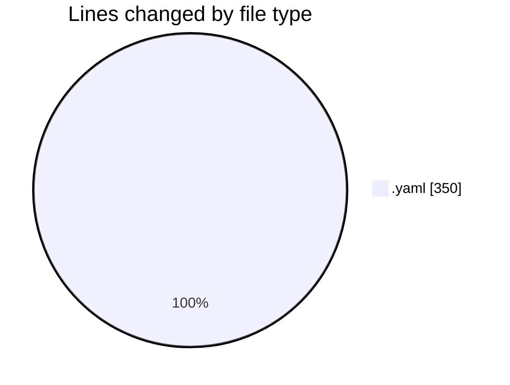
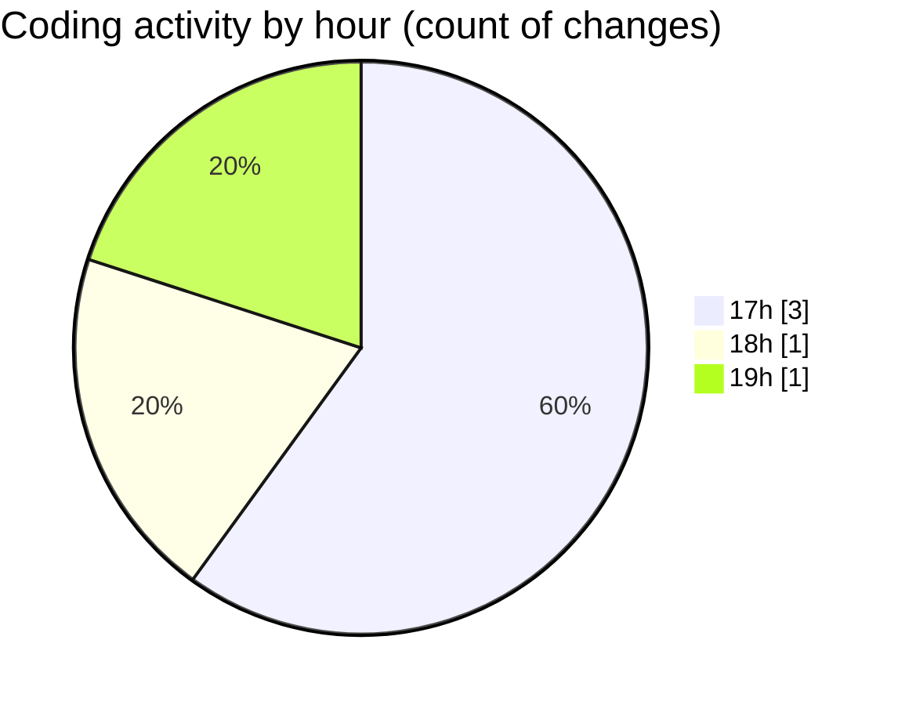

# argos_orchestrator - Activity Summary 

## Overall Statistics

| Stat                   | Value                                                             |
| ---------------------- | ----------------------------------------------------------------- |
| **Lines Added** (➕)   | 350                                          |
| **Lines Removed** (➖) | 0                                        |
| **Net Change** (↕)    | 350                |
| **Active Time** (⌚)   | 1 minute |

## Modified Files
- **sitl.yaml** (+8, -0)
- **drone.yaml** (+79, -0)
- **docker-compose.yaml** (+240, -0)
- **mqttgateway.yaml** (+23, -0)

## Visualizations

### By File Type (Lines Changed)

### By Hour (Estimated Activity Count)

> **Last Updated:** 10/07/2026, 19:06:31