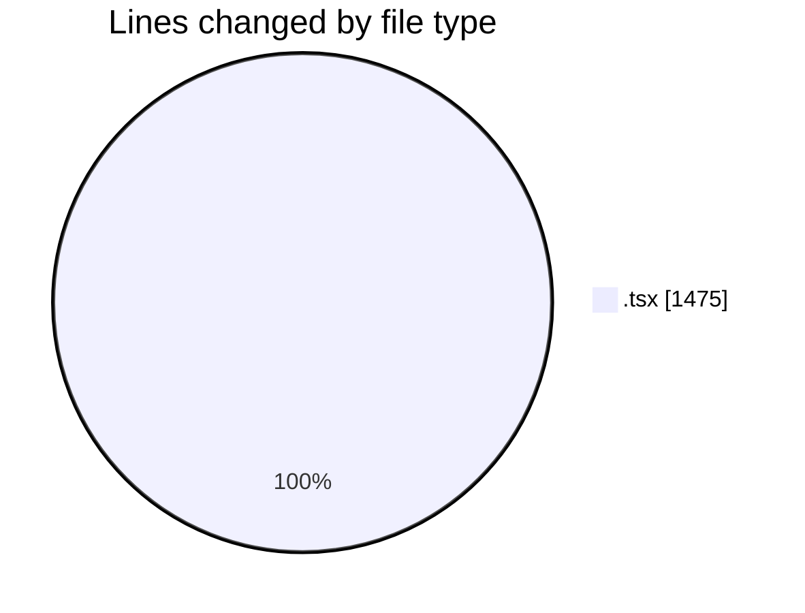
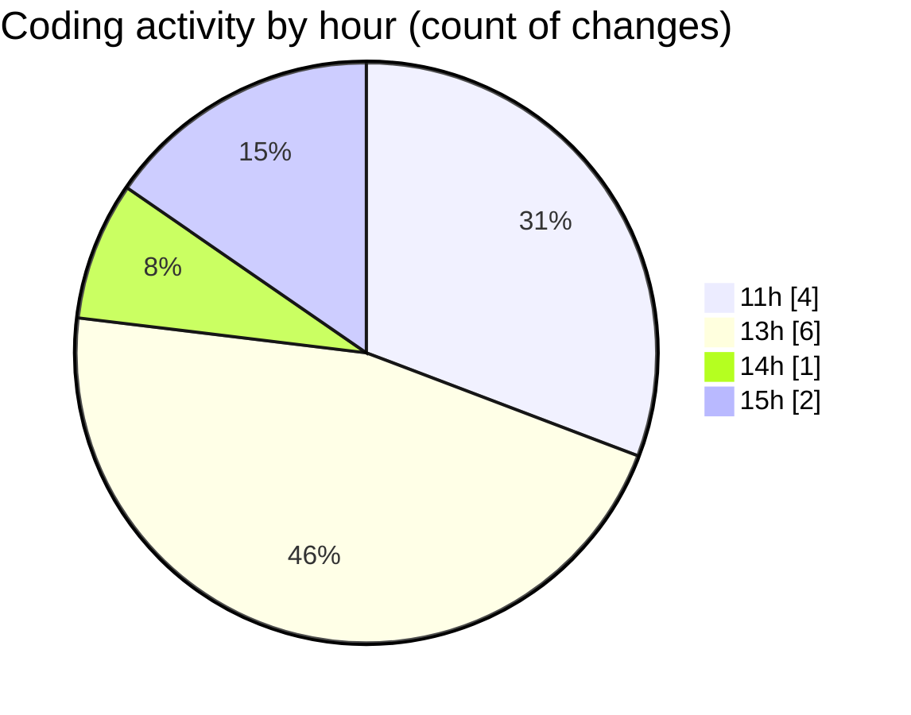

# nxtqube_webapp - Activity Summary 

## Overall Statistics

| Stat                   | Value                                                             |
| ---------------------- | ----------------------------------------------------------------- |
| **Lines Added** (➕)   | 1462                                          |
| **Lines Removed** (➖) | 13                                        |
| **Net Change** (↕)    | 1449                |
| **Active Time** (⌚)   | 12 minutes |

## Modified Files
- **SettingsSidebar.tsx** (+233, -0)
- **LaunchControl.tsx** (+398, -6)
- **use.data.stream.tsx** (+196, -0)
- **DetectionFilters.tsx** (+161, -7)
- **RightHalf.tsx** (+179, -0)
- **EmergencySwitches.tsx** (+295, -0)

## Visualizations

### By File Type (Lines Changed)

### By Hour (Estimated Activity Count)

> **Last Updated:** 11/07/2026, 15:22:36