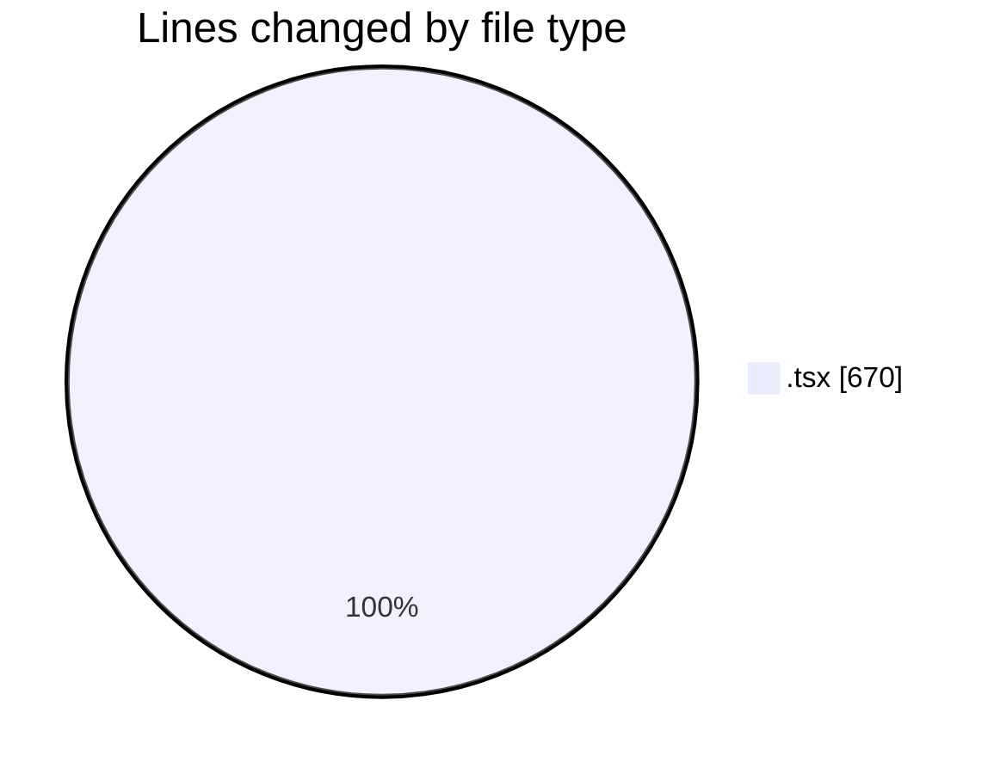
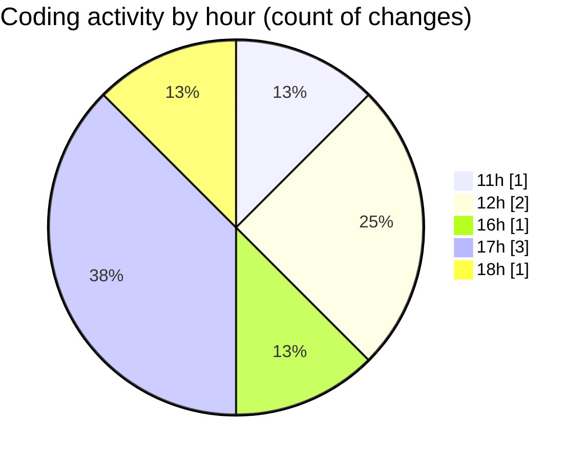

# nxtqube_webapp - Activity Summary 

## Overall Statistics

| Stat                   | Value                                                             |
| ---------------------- | ----------------------------------------------------------------- |
| **Lines Added** (➕)   | 666                                          |
| **Lines Removed** (➖) | 4                                        |
| **Net Change** (↕)    | 662                |
| **Active Time** (⌚)   | 3 minutes |

## Modified Files
- **IsInMission.tsx** (+17, -0)
- **Multicam.tsx** (+404, -2)
- **PageHeader.tsx** (+32, -2)
- **LeftHalf.tsx** (+213, -0)

## Visualizations

### By File Type (Lines Changed)

### By Hour (Estimated Activity Count)

> **Last Updated:** 12/07/2026, 18:22:27