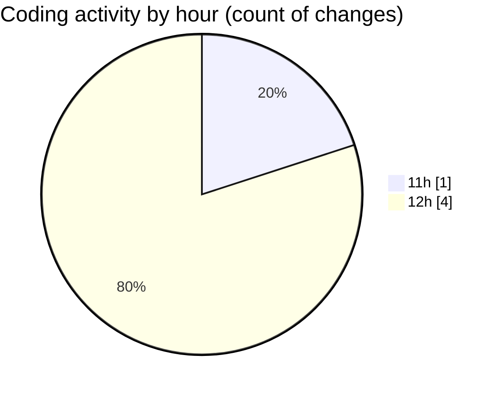

# nxtqube_webapp - Activity Summary 

## Overall Statistics

| Stat                   | Value                                                             |
| ---------------------- | ----------------------------------------------------------------- |
| **Lines Added** (➕)   | 557                                          |
| **Lines Removed** (➖) | 0                                        |
| **Net Change** (↕)    | 557                |
| **Active Time** (⌚)   | 6 minutes |

## Modified Files
- **DroneInfo.tsx** (+185, -0)
- **DockList.tsx** (+64, -0)
- **ReusableCard.tsx** (+243, -0)
- **SearchInput.tsx** (+65, -0)

## Visualizations

### By File Type (Lines Changed)

### By Hour (Estimated Activity Count)

> **Last Updated:** 13/07/2026, 12:41:19