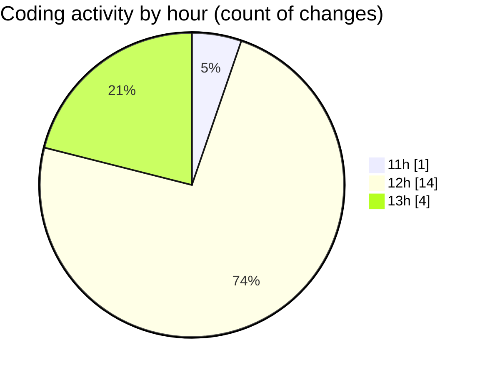

# nxtqube_webapp - Activity Summary 

## Overall Statistics

| Stat                   | Value                                                             |
| ---------------------- | ----------------------------------------------------------------- |
| **Lines Added** (➕)   | 2148                                          |
| **Lines Removed** (➖) | 49                                        |
| **Net Change** (↕)    | 2099                |
| **Active Time** (⌚)   | 25 minutes |

## Modified Files
- **DroneInfo.tsx** (+185, -0)
- **DockList.tsx** (+64, -0)
- **ReusableCard.tsx** (+243, -0)
- **SearchInput.tsx** (+65, -0)
- **MissionsLayout.tsx** (+77, -3)
- **MissionsNav.tsx** (+121, -46)
- **MissionPages.tsx** (+280, -0)
- **MissionSelector.tsx** (+176, -0)
- **Existing.tsx** (+462, -0)
- **MissionSlider.tsx** (+128, -0)
- **LaunchControl.tsx** (+347, -0)

## Visualizations

### By File Type (Lines Changed)

### By Hour (Estimated Activity Count)

> **Last Updated:** 13/07/2026, 13:26:19