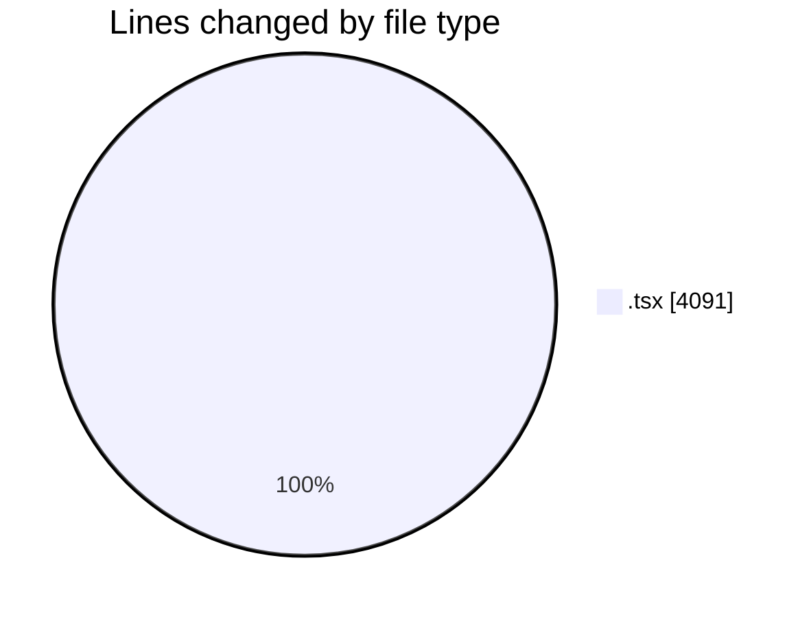
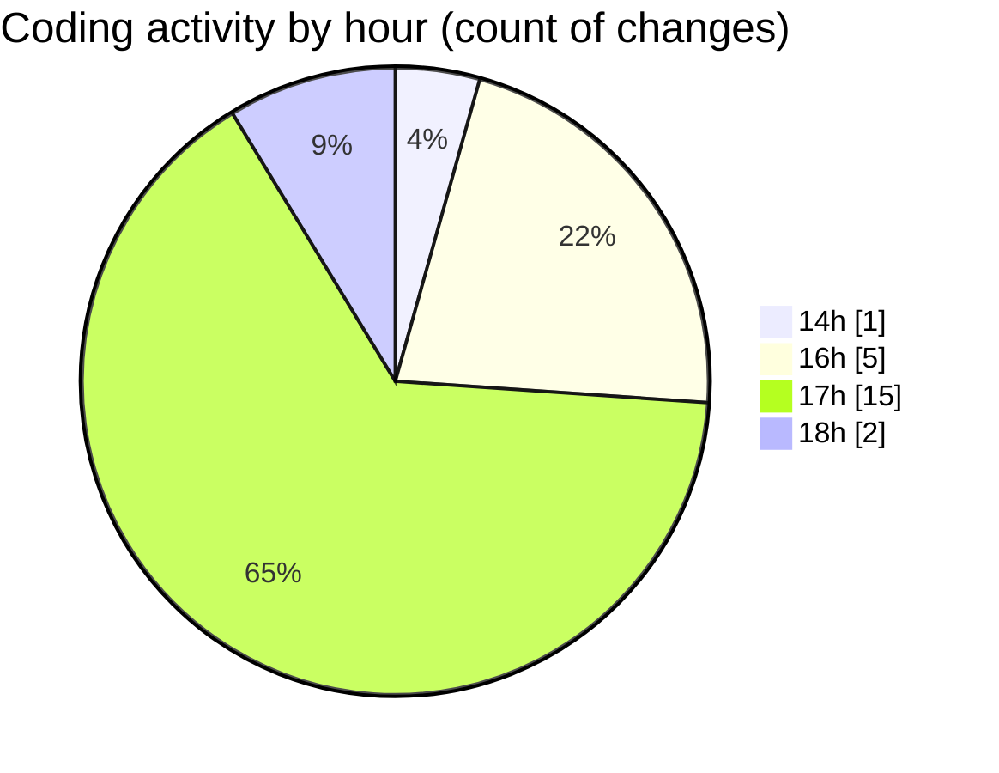

# nxtqube_webapp - Activity Summary 

## Overall Statistics

| Stat                   | Value                                                             |
| ---------------------- | ----------------------------------------------------------------- |
| **Lines Added** (➕)   | 4064                                          |
| **Lines Removed** (➖) | 27                                        |
| **Net Change** (↕)    | 4037                |
| **Active Time** (⌚)   | 30 minutes |

## Modified Files
- **LaunchControl.tsx** (+366, -9)
- **createMissionHome.tsx** (+329, -0)
- **MissionSelector.tsx** (+211, -2)
- **MissionsNav.tsx** (+84, -0)
- **createPathMission.tsx** (+933, -15)
- **create3DMission.tsx** (+1600, -0)
- **createGridMission.tsx** (+492, -1)
- **MissionActionButtons.tsx** (+49, -0)

## Visualizations

### By File Type (Lines Changed)

### By Hour (Estimated Activity Count)

> **Last Updated:** 15/07/2026, 18:10:04