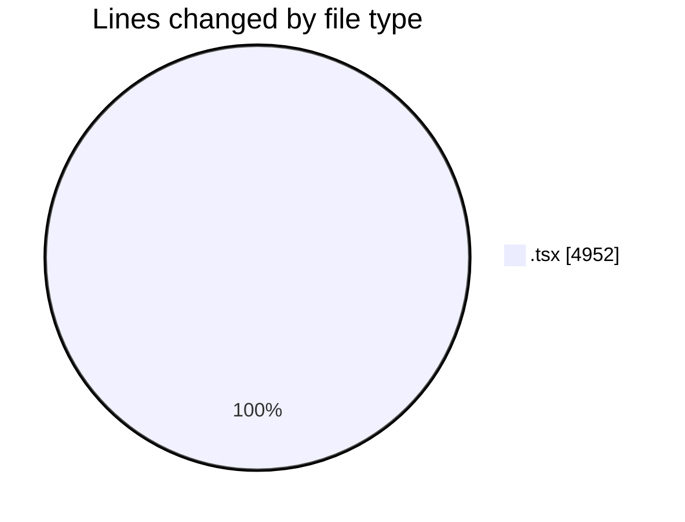
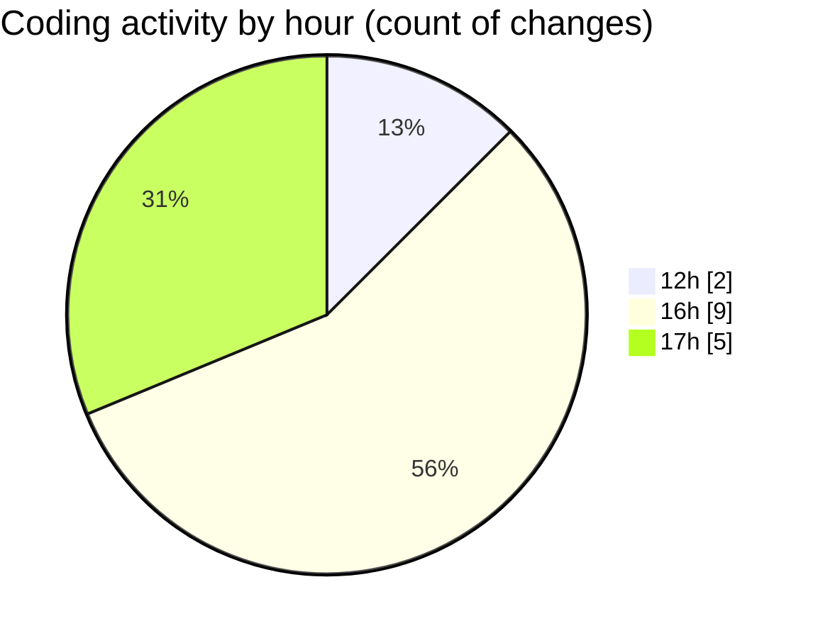

# nxtqube_webapp - Activity Summary 

## Overall Statistics

| Stat                   | Value                                                             |
| ---------------------- | ----------------------------------------------------------------- |
| **Lines Added** (➕)   | 4919                                          |
| **Lines Removed** (➖) | 33                                        |
| **Net Change** (↕)    | 4886                |
| **Active Time** (⌚)   | 17 minutes |

## Modified Files
- **ReusableCard.tsx** (+246, -0)
- **AppLayout.tsx** (+135, -0)
- **drone.details.panel.tsx** (+405, -31)
- **dock.details.panel.tsx** (+493, -2)
- **create.path.mission.tsx** (+920, -0)
- **waypoint.action.tsx** (+632, -0)
- **create.3d.mission.tsx** (+1630, -0)
- **orbit.mission.control.tsx** (+458, -0)

## Visualizations

### By File Type (Lines Changed)

### By Hour (Estimated Activity Count)

> **Last Updated:** 24/07/2026, 17:20:46