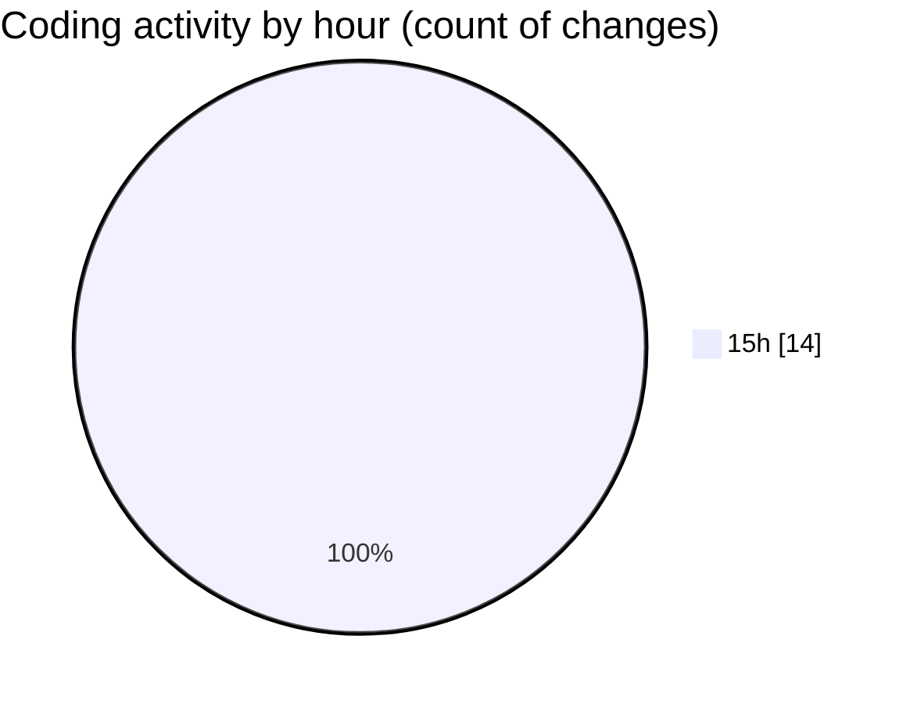

# nxtqube_webapp - Activity Summary 

## Overall Statistics

| Stat                   | Value                                                             |
| ---------------------- | ----------------------------------------------------------------- |
| **Lines Added** (➕)   | 587                                          |
| **Lines Removed** (➖) | 0                                        |
| **Net Change** (↕)    | 587                |
| **Active Time** (⌚)   | 16 minutes |

## Modified Files
- **MissionControl.tsx** (+105, -0)
- **RightHalf.tsx** (+182, -0)
- **ReusableCard.tsx** (+6, -0)
- **drone.list.tsx** (+165, -0)
- **dock.card.item.tsx** (+90, -0)
- **drone.details.panel.tsx** (+8, -0)
- **dock.details.panel.tsx** (+5, -0)
- **status.colors.ts** (+26, -0)

## Visualizations

### By File Type (Lines Changed)

### By Hour (Estimated Activity Count)

> **Last Updated:** 26/07/2026, 15:50:45