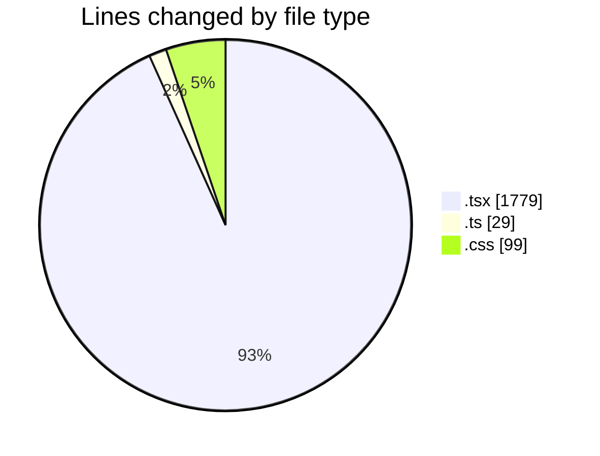
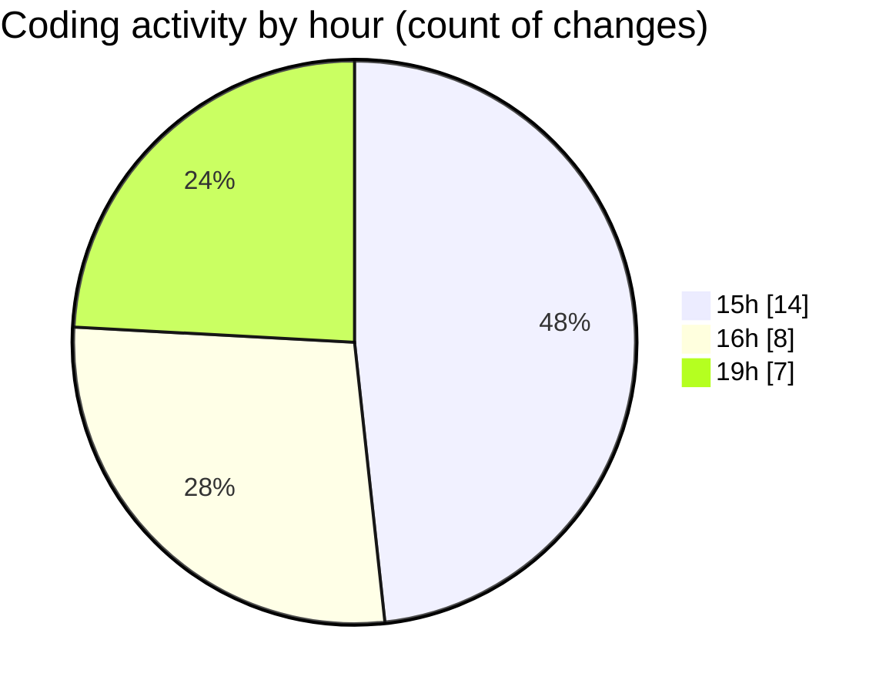

# nxtqube_webapp - Activity Summary 

## Overall Statistics

| Stat                   | Value                                                             |
| ---------------------- | ----------------------------------------------------------------- |
| **Lines Added** (➕)   | 1897                                          |
| **Lines Removed** (➖) | 10                                        |
| **Net Change** (↕)    | 1887                |
| **Active Time** (⌚)   | 34 minutes |

## Modified Files
- **MissionControl.tsx** (+105, -0)
- **RightHalf.tsx** (+182, -0)
- **ReusableCard.tsx** (+6, -0)
- **drone.list.tsx** (+169, -0)
- **dock.card.item.tsx** (+94, -0)
- **drone.details.panel.tsx** (+13, -2)
- **dock.details.panel.tsx** (+39, -0)
- **status.colors.ts** (+26, -3)
- **mission.selector.tsx** (+209, -5)
- **index.css** (+99, -0)
- **create.grid.mission.tsx** (+484, -0)
- **create.path.mission.tsx** (+7, -0)
- **waypoint.action.tsx** (+3, -0)
- **Existing.tsx** (+461, -0)

## Visualizations

### By File Type (Lines Changed)

### By Hour (Estimated Activity Count)

> **Last Updated:** 26/07/2026, 19:16:35