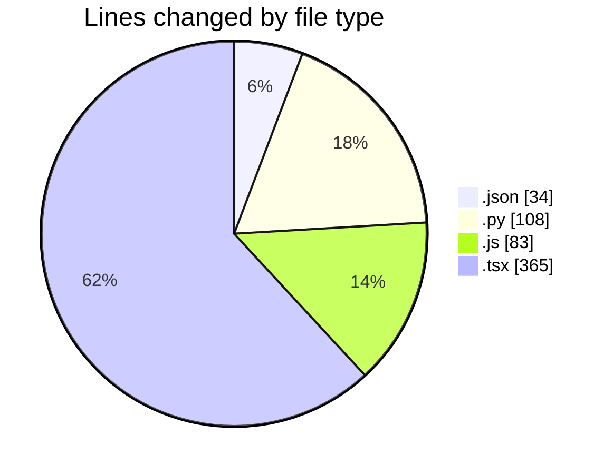
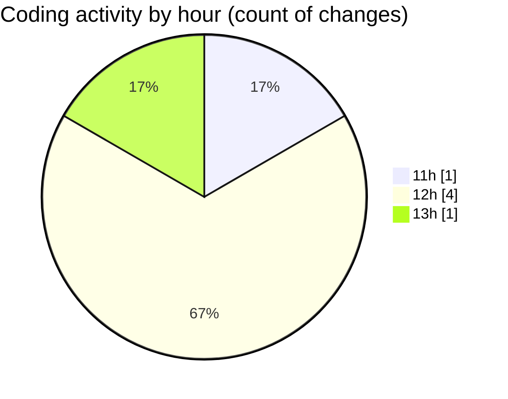

# nxtqube_webapp - Activity Summary 

## Overall Statistics

| Stat                   | Value                                                             |
| ---------------------- | ----------------------------------------------------------------- |
| **Lines Added** (➕)   | 479                                          |
| **Lines Removed** (➖) | 111                                        |
| **Net Change** (↕)    | 368                |
| **Active Time** (⌚)   | 1 minute |

## Modified Files
- **tsconfig.app.json** (+34, -0)
- **update_imports.py** (+108, -0)
- **eslint.config.js** (+83, -0)
- **dock.video.tsx** (+254, -111)

## Visualizations

### By File Type (Lines Changed)

### By Hour (Estimated Activity Count)

> **Last Updated:** 28/07/2026, 13:08:36