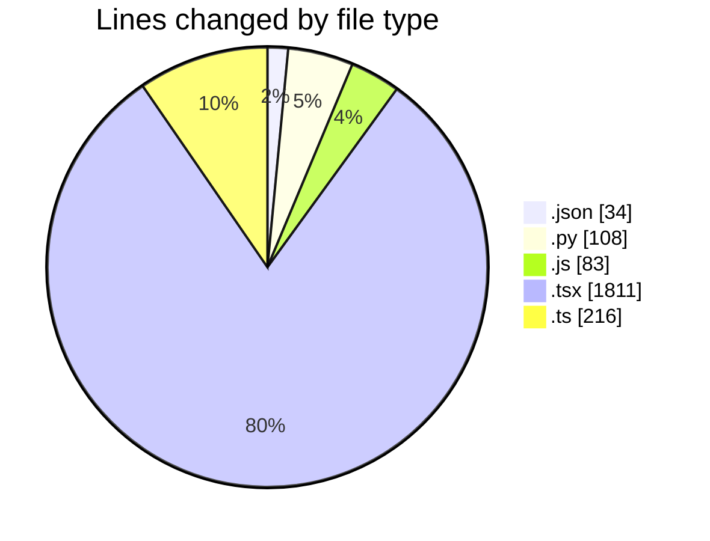
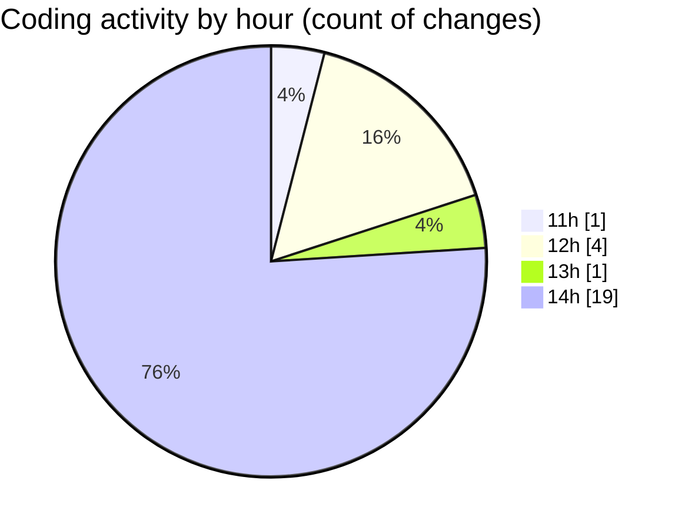

# nxtqube_webapp - Activity Summary 

## Overall Statistics

| Stat                   | Value                                                             |
| ---------------------- | ----------------------------------------------------------------- |
| **Lines Added** (➕)   | 1997                                          |
| **Lines Removed** (➖) | 255                                        |
| **Net Change** (↕)    | 1742                |
| **Active Time** (⌚)   | 20 minutes |

## Modified Files
- **tsconfig.app.json** (+34, -0)
- **update_imports.py** (+108, -0)
- **eslint.config.js** (+83, -0)
- **dock.video.tsx** (+359, -216)
- **router.tsx** (+259, -6)
- **webhook.trigger.action.modal.tsx** (+363, -5)
- **create.path.mission.tsx** (+2, -5)
- **mission.data.handler.ts** (+212, -4)
- **Existing.tsx** (+2, -5)
- **top.nav.tsx** (+202, -5)
- **reusable.card.tsx** (+339, -5)
- **fetch.safe.location.tsx** (+34, -4)

## Visualizations

### By File Type (Lines Changed)

### By Hour (Estimated Activity Count)

> **Last Updated:** 28/07/2026, 14:49:41