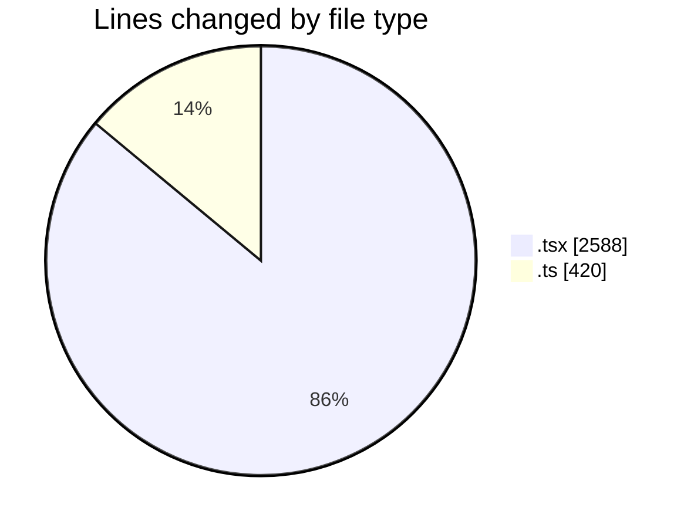
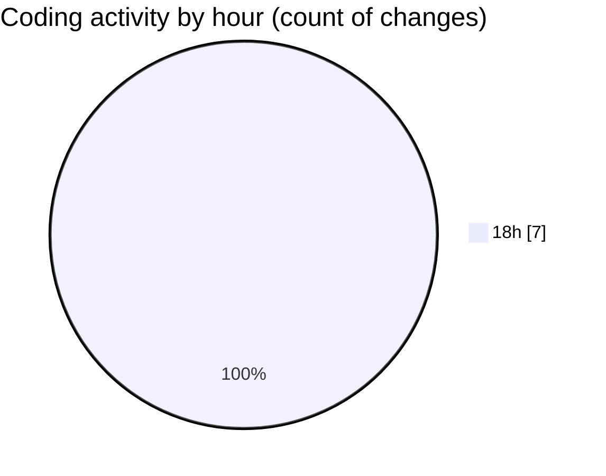

# nxtqube_webapp - Activity Summary 

## Overall Statistics

| Stat                   | Value                                                             |
| ---------------------- | ----------------------------------------------------------------- |
| **Lines Added** (➕)   | 3008                                          |
| **Lines Removed** (➖) | 0                                        |
| **Net Change** (↕)    | 3008                |
| **Active Time** (⌚)   | 0 minute |

## Modified Files
- **sort.mission.tsx** (+204, -0)
- **flows.tsx** (+810, -0)
- **mission.utils.ts** (+420, -0)
- **create.mission.flow.tsx** (+732, -0)
- **multicam.tsx** (+402, -0)
- **flight.info.tab.tsx** (+401, -0)
- **label.page.tsx** (+39, -0)

## Visualizations

### By File Type (Lines Changed)

### By Hour (Estimated Activity Count)

> **Last Updated:** 04/08/2026, 18:47:29