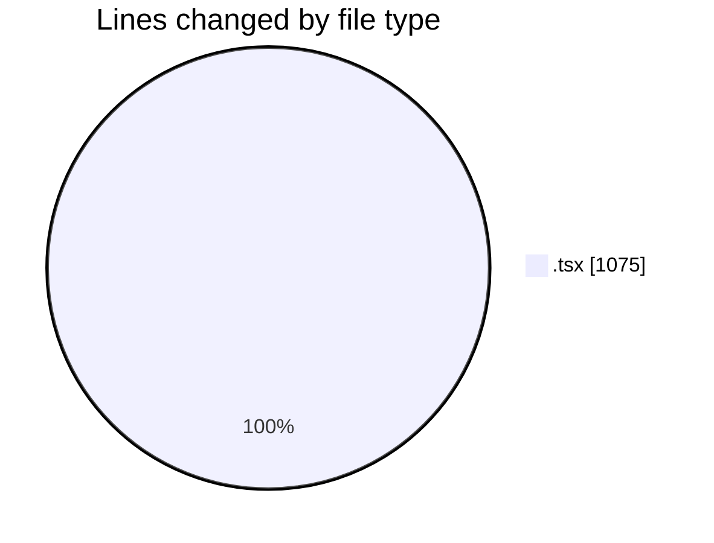
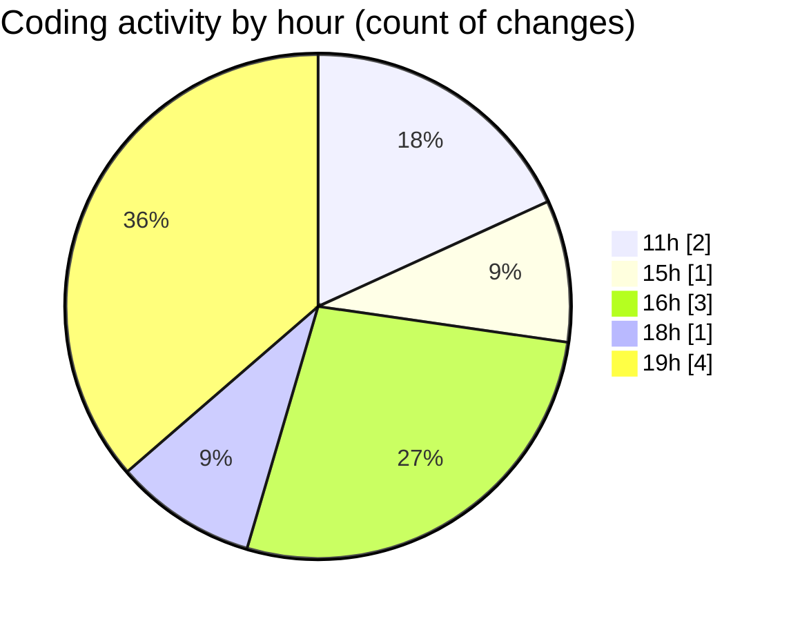

# nxtqube_webapp - Activity Summary 

## Overall Statistics

| Stat                   | Value                                                             |
| ---------------------- | ----------------------------------------------------------------- |
| **Lines Added** (➕)   | 1074                                          |
| **Lines Removed** (➖) | 1                                        |
| **Net Change** (↕)    | 1073                |
| **Active Time** (⌚)   | 9 minutes |

## Modified Files
- **docking.station.tsx** (+140, -1)
- **drone.filter.popover.tsx** (+97, -0)
- **drone.info.tsx** (+258, -0)
- **dock.details.panel.tsx** (+579, -0)

## Visualizations

### By File Type (Lines Changed)

### By Hour (Estimated Activity Count)

> **Last Updated:** 09/08/2026, 19:20:41