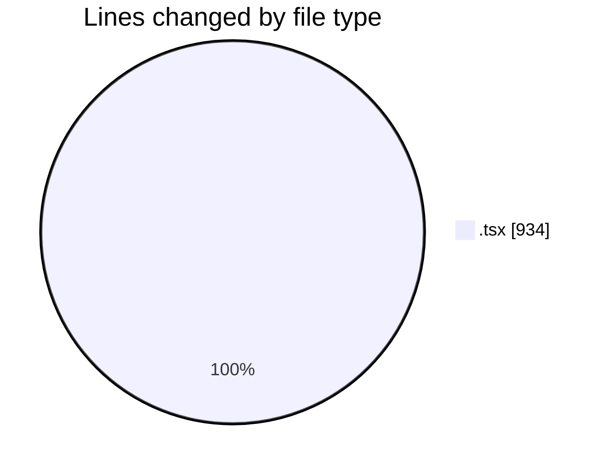
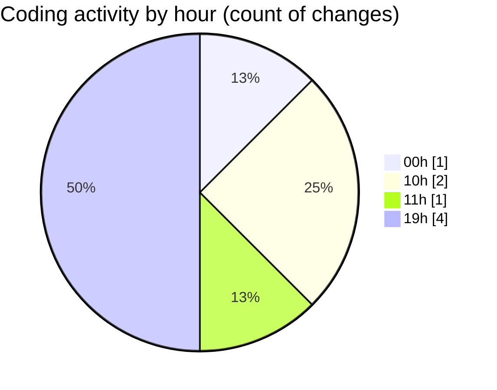

# nxtqube_webapp - Activity Summary 

## Overall Statistics

| Stat                   | Value                                                             |
| ---------------------- | ----------------------------------------------------------------- |
| **Lines Added** (➕)   | 922                                          |
| **Lines Removed** (➖) | 12                                        |
| **Net Change** (↕)    | 910                |
| **Active Time** (⌚)   | 9 minutes |

## Modified Files
- **mission.selector.tsx** (+204, -0)
- **multicam.filter.popover.tsx** (+226, -6)
- **dock.details.panel.tsx** (+17, -0)
- **flight.info.tab.tsx** (+409, -6)
- **active.mission.list.tsx** (+66, -0)

## Visualizations

### By File Type (Lines Changed)

### By Hour (Estimated Activity Count)

> **Last Updated:** 10/08/2026, 19:28:43