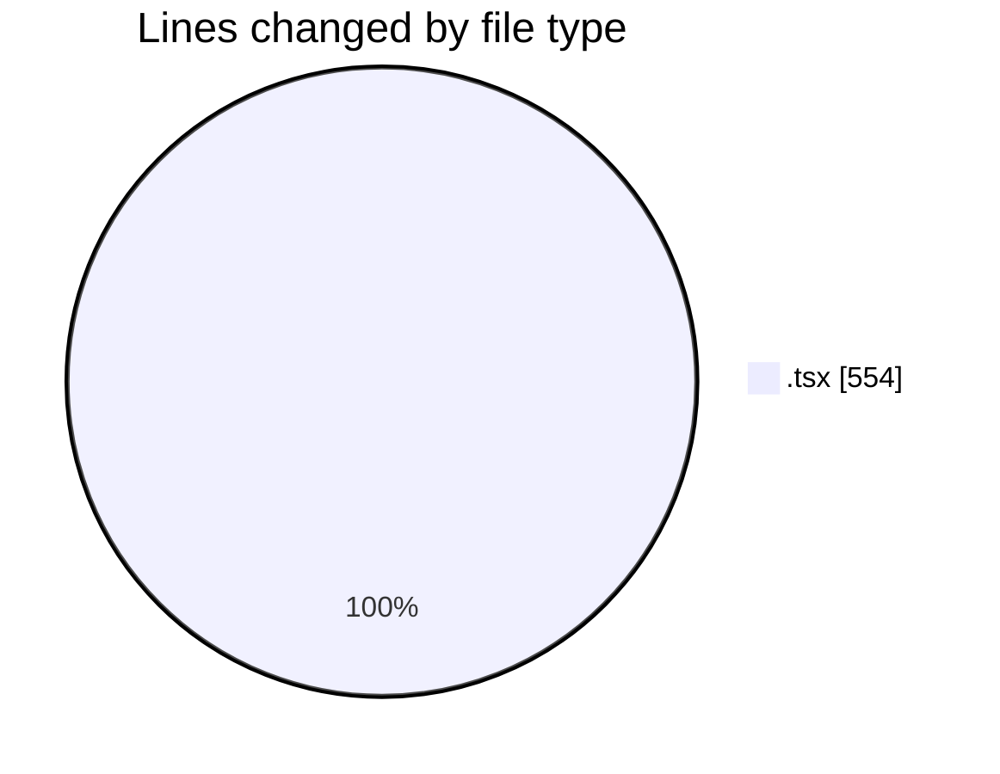
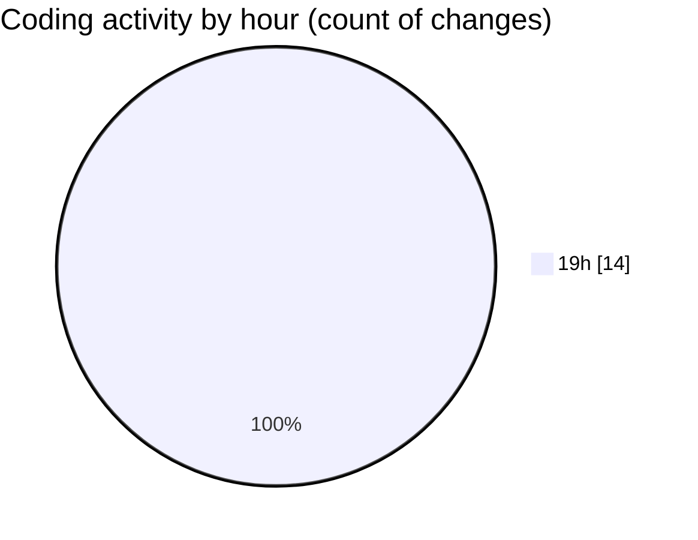

# nxtqube_webapp - Activity Summary 

## Overall Statistics

| Stat                   | Value                                                             |
| ---------------------- | ----------------------------------------------------------------- |
| **Lines Added** (➕)   | 541                                          |
| **Lines Removed** (➖) | 13                                        |
| **Net Change** (↕)    | 528                |
| **Active Time** (⌚)   | 27 minutes |

## Modified Files
- **map.controls.tsx** (+38, -0)
- **cesium.container.tsx** (+68, -0)
- **map.controls.tsx** (+67, -0)
- **cesium.container.tsx** (+308, -13)
- **drone.tsx** (+60, -0)

## Visualizations

### By File Type (Lines Changed)

### By Hour (Estimated Activity Count)

> **Last Updated:** 13/08/2026, 19:34:37