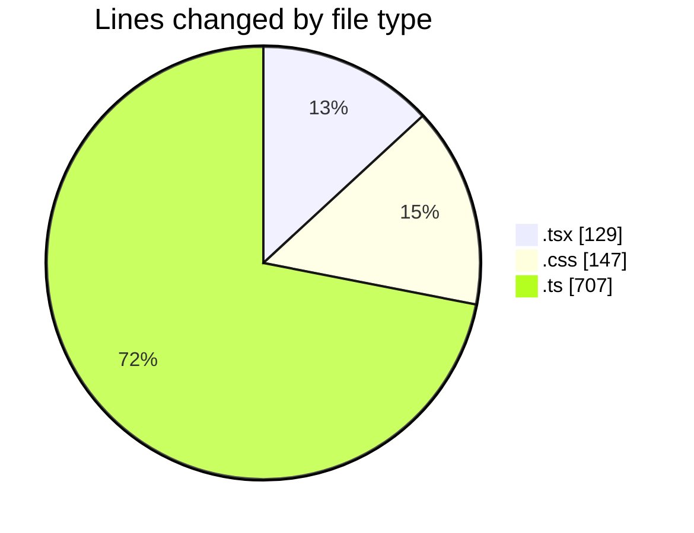
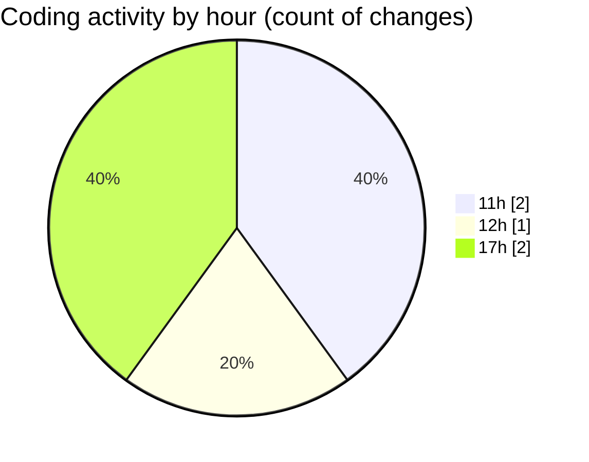

# nxtqube_webapp - Activity Summary 

## Overall Statistics

| Stat                   | Value                                                             |
| ---------------------- | ----------------------------------------------------------------- |
| **Lines Added** (➕)   | 983                                          |
| **Lines Removed** (➖) | 0                                        |
| **Net Change** (↕)    | 983                |
| **Active Time** (⌚)   | 2 minutes |

## Modified Files
- **cesium.container.tsx** (+26, -0)
- **index.css** (+147, -0)
- **command.controller.ts** (+707, -0)
- **dock.card.item.tsx** (+103, -0)

## Visualizations

### By File Type (Lines Changed)

### By Hour (Estimated Activity Count)

> **Last Updated:** 14/08/2026, 17:12:03