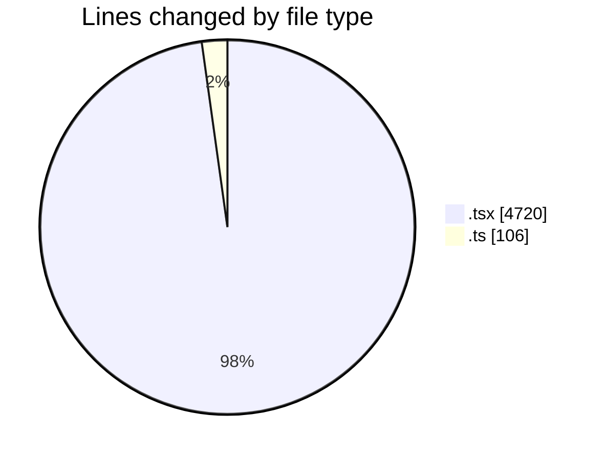
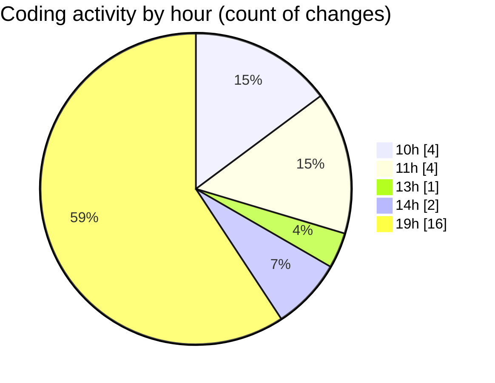

# nxtqube_webapp - Activity Summary 

## Overall Statistics

| Stat                   | Value                                                             |
| ---------------------- | ----------------------------------------------------------------- |
| **Lines Added** (➕)   | 4764                                          |
| **Lines Removed** (➖) | 62                                        |
| **Net Change** (↕)    | 4702                |
| **Active Time** (⌚)   | 25 minutes |

## Modified Files
- **SortMission.test.tsx** (+139, -0)
- **ExistingMissions.test.tsx** (+211, -0)
- **GridMissionData.test.ts** (+106, -0)
- **stack.mission.control.tsx** (+682, -0)
- **create.3d.mission.tsx** (+1633, -0)
- **create.mission.flow.tsx** (+1063, -6)
- **behaviour.dock.modal.tsx** (+99, -7)
- **finish.mission.modal.tsx** (+115, -7)
- **custom.time.picker.tsx** (+226, -6)
- **multicam.tsx** (+490, -36)

## Visualizations

### By File Type (Lines Changed)

### By Hour (Estimated Activity Count)

> **Last Updated:** 16/08/2026, 19:16:24