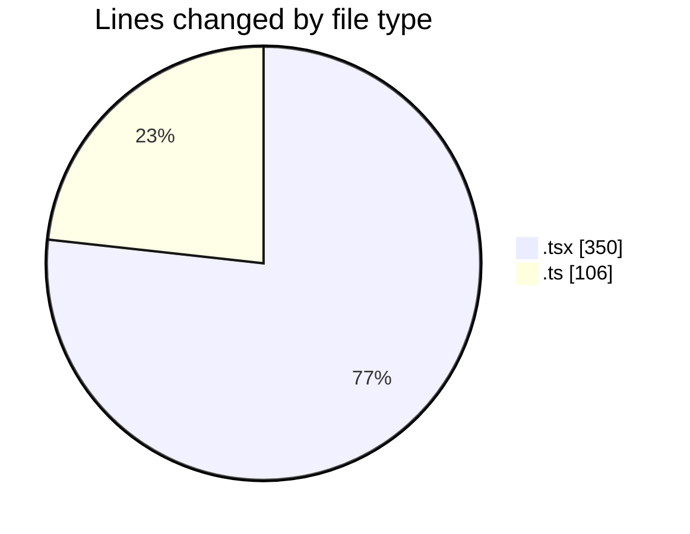
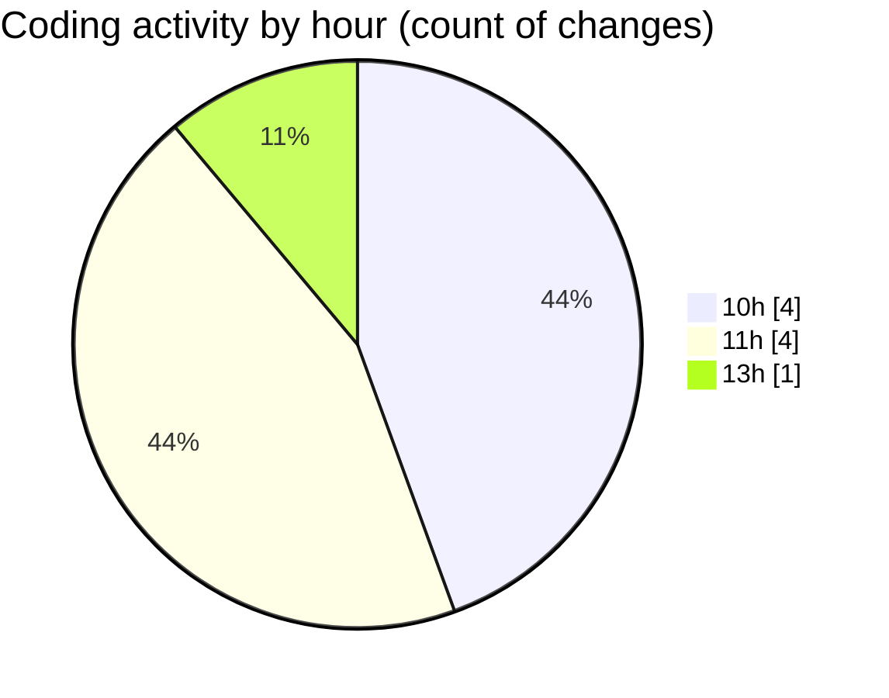

# nxtqube_webapp - Activity Summary 

## Overall Statistics

| Stat                   | Value                                                             |
| ---------------------- | ----------------------------------------------------------------- |
| **Lines Added** (➕)   | 456                                          |
| **Lines Removed** (➖) | 0                                        |
| **Net Change** (↕)    | 456                |
| **Active Time** (⌚)   | 10 minutes |

## Modified Files
- **SortMission.test.tsx** (+139, -0)
- **ExistingMissions.test.tsx** (+211, -0)
- **GridMissionData.test.ts** (+106, -0)

## Visualizations

### By File Type (Lines Changed)

### By Hour (Estimated Activity Count)

> **Last Updated:** 16/08/2026, 13:38:37