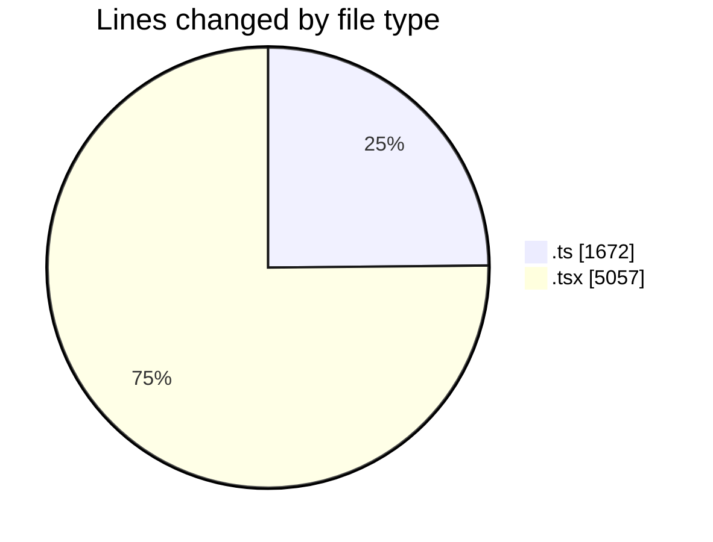
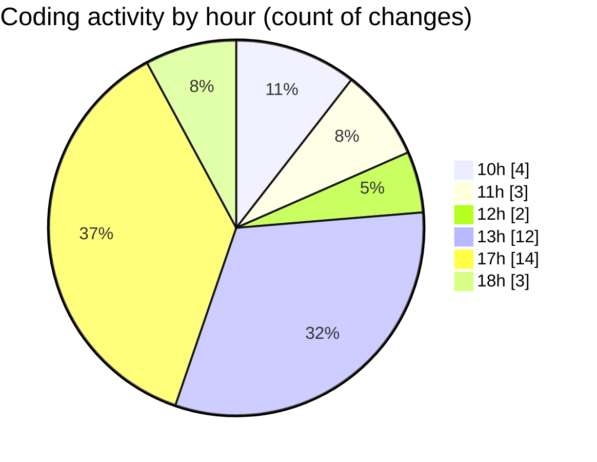

# nxtqube_webapp - Activity Summary 

## Overall Statistics

| Stat                   | Value                                                             |
| ---------------------- | ----------------------------------------------------------------- |
| **Lines Added** (➕)   | 6348                                          |
| **Lines Removed** (➖) | 381                                        |
| **Net Change** (↕)    | 5967                |
| **Active Time** (⌚)   | 49 minutes |

## Modified Files
- **GridMissionCoverage.todo.test.ts** (+518, -0)
- **MissionControlAndWaypointAction.test.tsx** (+329, -14)
- **MissionPageUtils.test.ts** (+269, -43)
- **MissionInfoPathGaps.test.tsx** (+147, -0)
- **GridMissionControls.test.tsx** (+116, -0)
- **MissionWorkflows.test.tsx** (+170, -0)
- **MissionCoverage.todo.test.ts** (+98, -0)
- **GridMissionData.test.ts** (+152, -0)
- **CreatePathAndPointMission.test.tsx** (+331, -0)
- **ExistingMissionCard.test.tsx** (+260, -0)
- **ThreeDMissionCoverage.todo.test.ts** (+592, -0)
- **ThreeDMissionCoverage.todo.test.tsx** (+590, -0)
- **user.permissions.dialog.tsx** (+407, -109)
- **change.password.tsx** (+229, -33)
- **users.create.tsx** (+383, -33)
- **users.list.tsx** (+451, -81)
- **annotation.create.tsx** (+1306, -68)

## Visualizations

### By File Type (Lines Changed)

### By Hour (Estimated Activity Count)

> **Last Updated:** 21/08/2026, 18:05:30