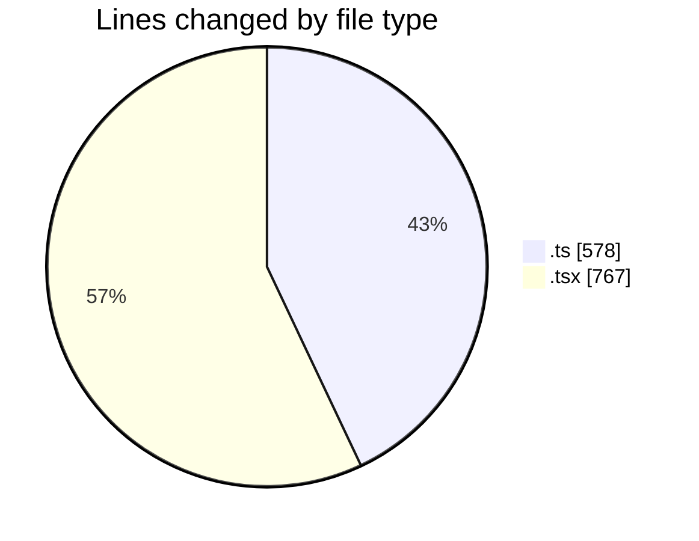
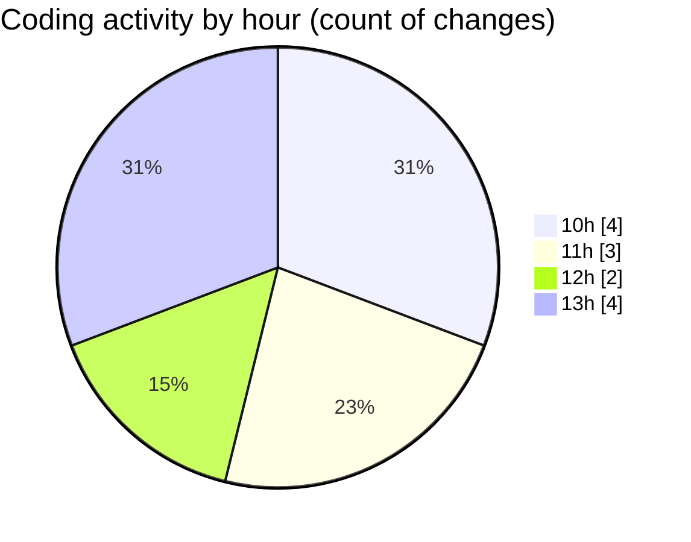

# nxtqube_webapp - Activity Summary 

## Overall Statistics

| Stat                   | Value                                                             |
| ---------------------- | ----------------------------------------------------------------- |
| **Lines Added** (➕)   | 1340                                          |
| **Lines Removed** (➖) | 5                                        |
| **Net Change** (↕)    | 1335                |
| **Active Time** (⌚)   | 15 minutes |

## Modified Files
- **GridMissionCoverage.todo.test.ts** (+59, -0)
- **MissionControlAndWaypointAction.test.tsx** (+329, -5)
- **MissionPageUtils.test.ts** (+269, -0)
- **MissionInfoPathGaps.test.tsx** (+147, -0)
- **GridMissionControls.test.tsx** (+116, -0)
- **MissionWorkflows.test.tsx** (+170, -0)
- **MissionCoverage.todo.test.ts** (+98, -0)
- **GridMissionData.test.ts** (+152, -0)

## Visualizations

### By File Type (Lines Changed)

### By Hour (Estimated Activity Count)

> **Last Updated:** 21/08/2026, 13:10:33