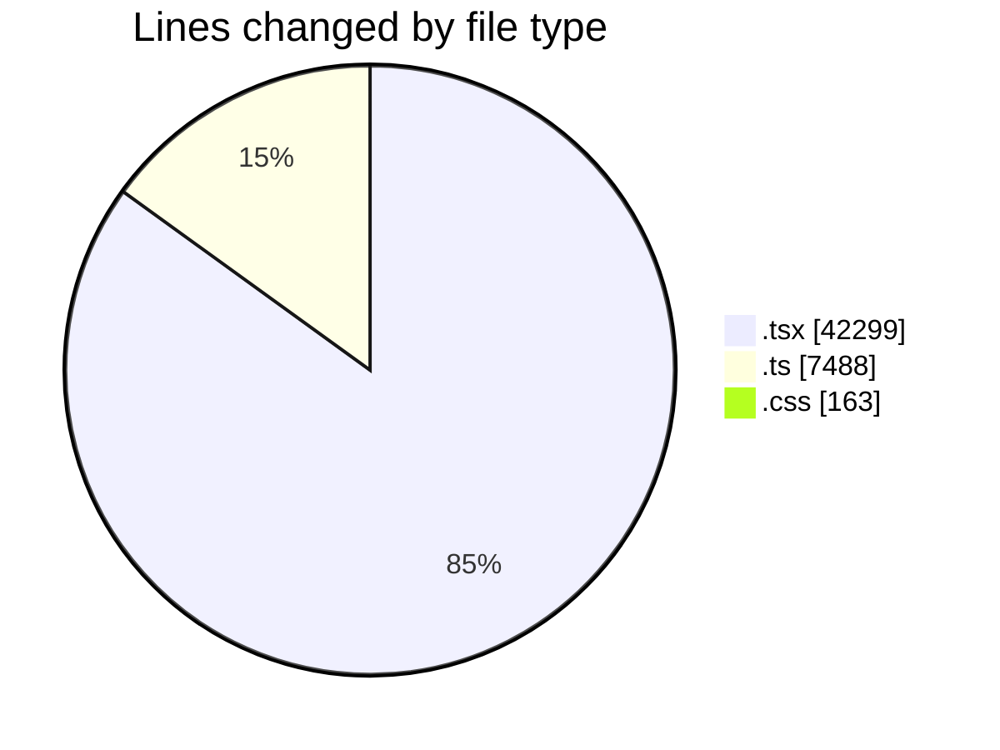
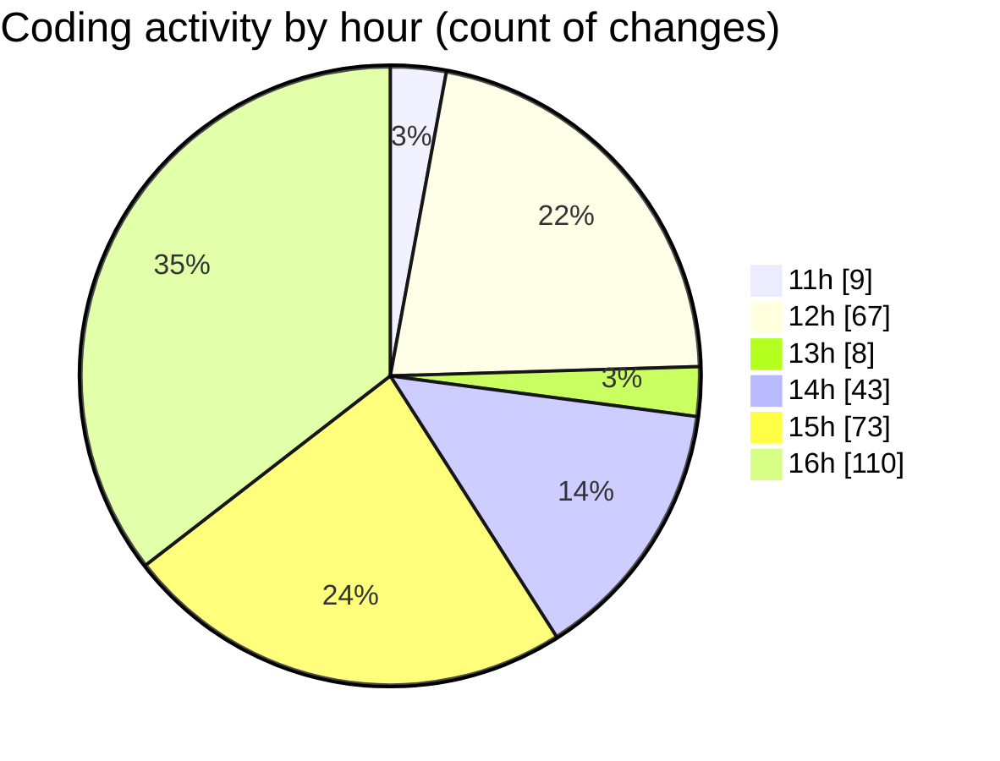

# nxtqube_webapp - Activity Summary 

## Overall Statistics

| Stat                   | Value                                                             |
| ---------------------- | ----------------------------------------------------------------- |
| **Lines Added** (➕)   | 39547                                          |
| **Lines Removed** (➖) | 10403                                        |
| **Net Change** (↕)    | 29144                |
| **Active Time** (⌚)   | 336 minutes |

## Modified Files
- **latitude.icon.tsx** (+43, -4)
- **drone.unbind.dialog.tsx** (+107, -0)
- **longitude.icon.tsx** (+64, -44)
- **drone.info.tsx** (+761, -438)
- **drone.skeleton.tsx** (+68, -44)
- **create.3d.mission.tsx** (+1702, -69)
- **create.grid.mission.tsx** (+514, -34)
- **create.mission.home.tsx** (+351, -179)
- **create.path.mission.tsx** (+944, -23)
- **orbit.mission.control.tsx** (+971, -513)
- **stack.mission.control.tsx** (+1445, -763)
- **mission.controls.tsx** (+817, -416)
- **mission.info.tsx** (+624, -70)
- **waypoint.action.tsx** (+1317, -682)
- **delete.mission.tsx** (+72, -6)
- **mission.slider.tsx** (+132, -4)
- **existing.mission.tsx** (+654, -11)
- **existing.tsx** (+678, -165)
- **manage.mission.tsx** (+240, -43)
- **sort.mission.tsx** (+656, -428)
- **left.half.tsx** (+222, -6)
- **middle.controls.tsx** (+95, -16)
- **detection.filters.tsx** (+146, -6)
- **dock.options.tsx** (+97, -10)
- **manual.controls.tsx** (+417, -16)
- **micro.phone.tsx** (+181, -7)
- **right.controls.tsx** (+130, -24)
- **speed.info.tsx** (+139, -4)
- **app.layout.tsx** (+147, -31)
- **docking.station.tsx** (+406, -236)
- **geofence.alt.tsx** (+126, -74)
- **multicam.tsx** (+1152, -240)
- **mission.pages.tsx** (+309, -25)
- **mission.selector.tsx** (+280, -76)
- **missions.layout.tsx** (+148, -97)
- **missions.nav.tsx** (+104, -58)
- **mission.data.handler.ts** (+212, -4)
- **top.nav.tsx** (+241, -34)
- **fetch.safe.location.tsx** (+34, -4)
- **analytics.tsx** (+1271, -371)
- **Flowlogs.tsx** (+264, -4)
- **app.ts** (+110, -26)
- **env.config.ts** (+249, -13)
- **trigger.controller.ts** (+1052, -5)
- **automation.middleware.ts** (+308, -167)
- **flight-stream.route.ts** (+431, -234)
- **twilio.webhook.route.ts** (+121, -74)
- **automation.agent.service.ts** (+1854, -958)
- **state.machine.ts** (+137, -78)
- **dock.stream.handler.ts** (+190, -20)
- **drone.stream.handler.ts** (+218, -19)
- **flight-stream.template.ts** (+668, -340)
- **index.css** (+152, -11)
- **router.tsx** (+546, -36)
- **users.create.tsx** (+0, -1)
- **page.loading.tsx** (+155, -140)
- **welcome.page.tsx** (+176, -128)
- **annotation.list.tsx** (+1284, -3)
- **dock.details.panel.tsx** (+669, -73)
- **video.stream.tsx** (+153, -19)
- **video.stream.tsx** (+84, -9)
- **source.details.modal.tsx** (+330, -31)
- **webhook.trigger.action.modal.tsx** (+814, -531)
- **create.flow.tsx** (+462, -11)
- **create.mission.flow.tsx** (+1048, -3)
- **flow.details.tsx** (+1117, -579)
- **action.section.tsx** (+361, -217)
- **select.dialog.tsx** (+402, -239)
- **geofence.card.tsx** (+256, -37)
- **geogence.list.tsx** (+317, -13)
- **right.half.tsx** (+229, -4)
- **emergency.switches.tsx** (+464, -334)
- **video.stream.container.tsx** (+117, -70)
- **detailed.log.tsx** (+464, -3)
- **overlay.sidebar.tsx** (+600, -5)
- **prompt.manager.tsx** (+599, -5)
- **schedule.form.tsx** (+1823, -8)
- **data.management.tsx** (+246, -10)
- **home.location.tsx** (+211, -11)
- **rally.points.tsx** (+224, -4)
- **safe.location.tsx** (+242, -11)
- **controller.tab.tsx** (+296, -201)
- **gamepad.tab.tsx** (+284, -195)
- **page.tsx** (+161, -5)
- **manage.site.dialog.tsx** (+212, -4)
- **pagination.ui.tsx** (+324, -207)
- **reusable.card.tsx** (+293, -23)
- **site.list.tsx** (+415, -5)
- **site.update.tsx** (+397, -4)
- **dock.list.tsx** (+1, -0)

## Visualizations

### By File Type (Lines Changed)

### By Hour (Estimated Activity Count)

> **Last Updated:** 23/08/2026, 16:55:15