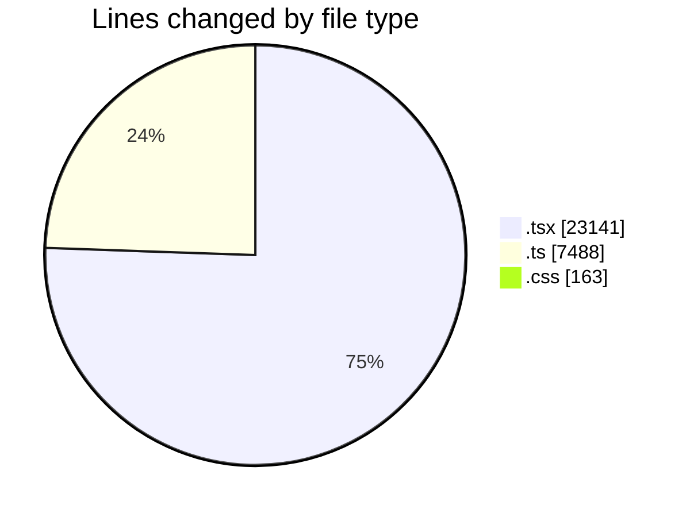
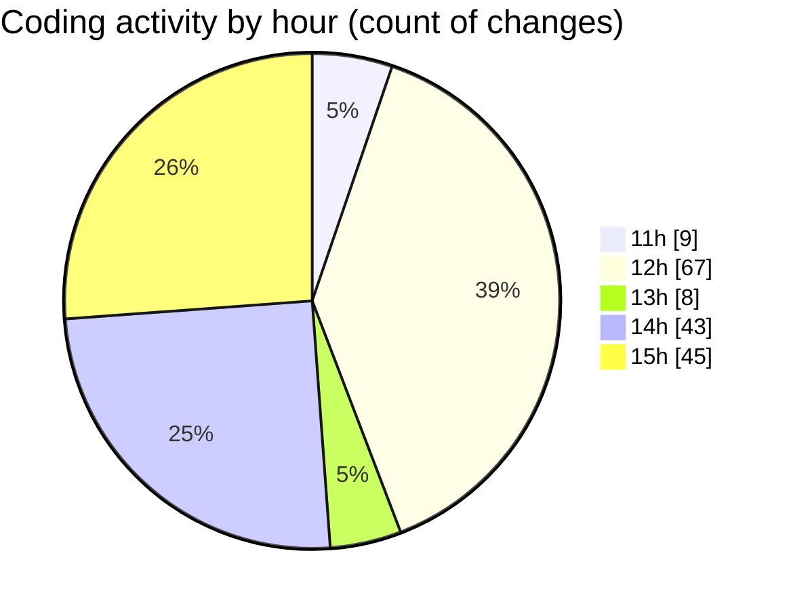

# nxtqube_webapp - Activity Summary 

## Overall Statistics

| Stat                   | Value                                                             |
| ---------------------- | ----------------------------------------------------------------- |
| **Lines Added** (➕)   | 23936                                          |
| **Lines Removed** (➖) | 6856                                        |
| **Net Change** (↕)    | 17080                |
| **Active Time** (⌚)   | 177 minutes |

## Modified Files
- **latitude.icon.tsx** (+39, -0)
- **drone.unbind.dialog.tsx** (+107, -0)
- **longitude.icon.tsx** (+60, -40)
- **drone.info.tsx** (+744, -421)
- **drone.skeleton.tsx** (+68, -44)
- **create.3d.mission.tsx** (+1662, -29)
- **create.grid.mission.tsx** (+510, -30)
- **create.mission.home.tsx** (+351, -179)
- **create.path.mission.tsx** (+944, -23)
- **orbit.mission.control.tsx** (+956, -494)
- **stack.mission.control.tsx** (+1431, -749)
- **mission.controls.tsx** (+817, -416)
- **mission.info.tsx** (+624, -70)
- **waypoint.action.tsx** (+1317, -682)
- **delete.mission.tsx** (+72, -6)
- **mission.slider.tsx** (+132, -4)
- **existing.mission.tsx** (+649, -6)
- **existing.tsx** (+604, -91)
- **manage.mission.tsx** (+240, -43)
- **sort.mission.tsx** (+656, -428)
- **left.half.tsx** (+222, -6)
- **middle.controls.tsx** (+95, -16)
- **detection.filters.tsx** (+146, -6)
- **dock.options.tsx** (+97, -10)
- **manual.controls.tsx** (+417, -16)
- **micro.phone.tsx** (+181, -7)
- **right.controls.tsx** (+130, -24)
- **speed.info.tsx** (+139, -4)
- **app.layout.tsx** (+123, -7)
- **docking.station.tsx** (+355, -185)
- **geofence.alt.tsx** (+126, -58)
- **multicam.tsx** (+1148, -232)
- **mission.pages.tsx** (+309, -25)
- **mission.selector.tsx** (+280, -76)
- **missions.layout.tsx** (+148, -97)
- **missions.nav.tsx** (+104, -58)
- **mission.data.handler.ts** (+212, -4)
- **top.nav.tsx** (+221, -14)
- **fetch.safe.location.tsx** (+34, -4)
- **analytics.tsx** (+1166, -266)
- **Flowlogs.tsx** (+264, -4)
- **app.ts** (+110, -26)
- **env.config.ts** (+249, -13)
- **trigger.controller.ts** (+1052, -5)
- **automation.middleware.ts** (+308, -167)
- **flight-stream.route.ts** (+431, -234)
- **twilio.webhook.route.ts** (+121, -74)
- **automation.agent.service.ts** (+1854, -958)
- **state.machine.ts** (+137, -78)
- **dock.stream.handler.ts** (+190, -20)
- **drone.stream.handler.ts** (+218, -19)
- **flight-stream.template.ts** (+668, -340)
- **index.css** (+152, -11)
- **router.tsx** (+546, -36)
- **users.create.tsx** (+0, -1)

## Visualizations

### By File Type (Lines Changed)

### By Hour (Estimated Activity Count)

> **Last Updated:** 23/08/2026, 15:46:47