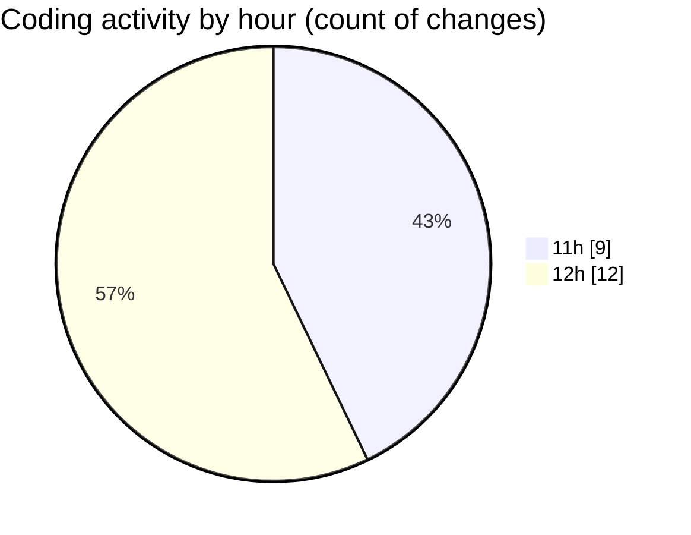

# nxtqube_webapp - Activity Summary 

## Overall Statistics

| Stat                   | Value                                                             |
| ---------------------- | ----------------------------------------------------------------- |
| **Lines Added** (➕)   | 3370                                          |
| **Lines Removed** (➖) | 743                                        |
| **Net Change** (↕)    | 2627                |
| **Active Time** (⌚)   | 22 minutes |

## Modified Files
- **latitude.icon.tsx** (+39, -0)
- **drone.unbind.dialog.tsx** (+107, -0)
- **longitude.icon.tsx** (+60, -40)
- **drone.info.tsx** (+744, -421)
- **drone.skeleton.tsx** (+68, -44)
- **create.3d.mission.tsx** (+1662, -29)
- **create.grid.mission.tsx** (+510, -30)
- **create.mission.home.tsx** (+180, -179)

## Visualizations

### By File Type (Lines Changed)

### By Hour (Estimated Activity Count)

> **Last Updated:** 23/08/2026, 12:27:07