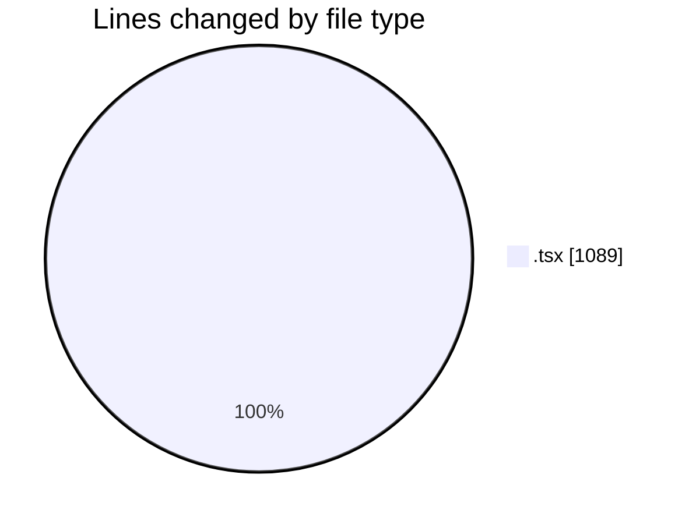
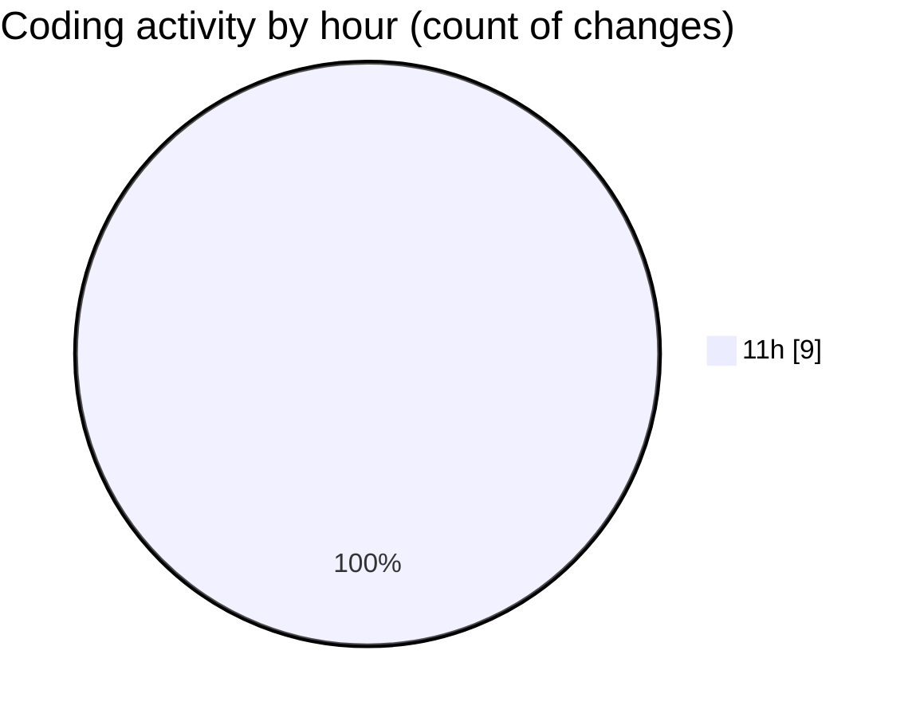

# nxtqube_webapp - Activity Summary 

## Overall Statistics

| Stat                   | Value                                                             |
| ---------------------- | ----------------------------------------------------------------- |
| **Lines Added** (➕)   | 628                                          |
| **Lines Removed** (➖) | 461                                        |
| **Net Change** (↕)    | 167                |
| **Active Time** (⌚)   | 10 minutes |

## Modified Files
- **latitude.icon.tsx** (+39, -0)
- **drone.unbind.dialog.tsx** (+107, -0)
- **longitude.icon.tsx** (+60, -40)
- **drone.info.tsx** (+422, -421)

## Visualizations

### By File Type (Lines Changed)

### By Hour (Estimated Activity Count)

> **Last Updated:** 23/08/2026, 11:37:07