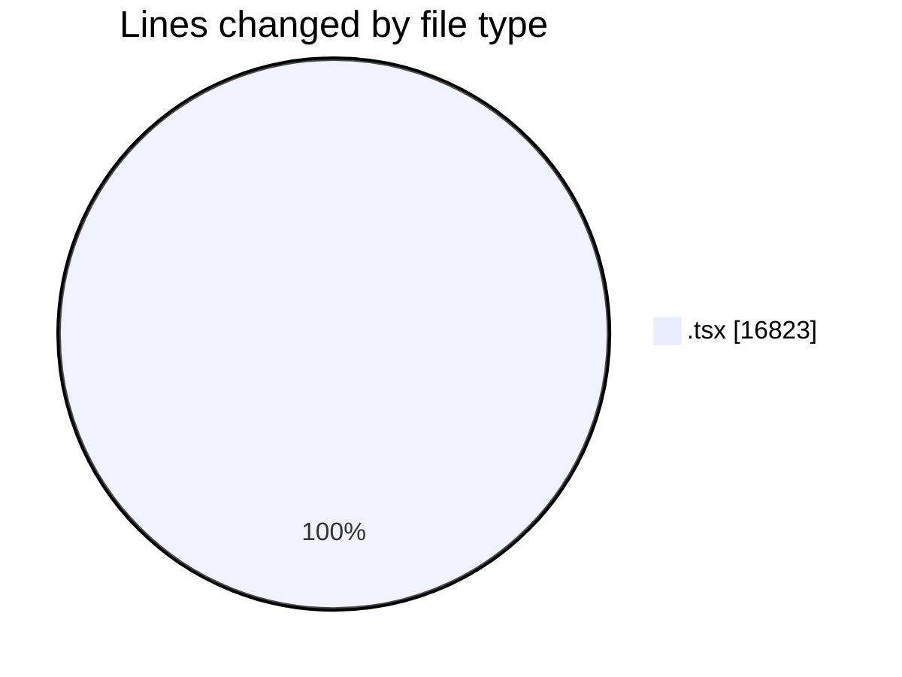
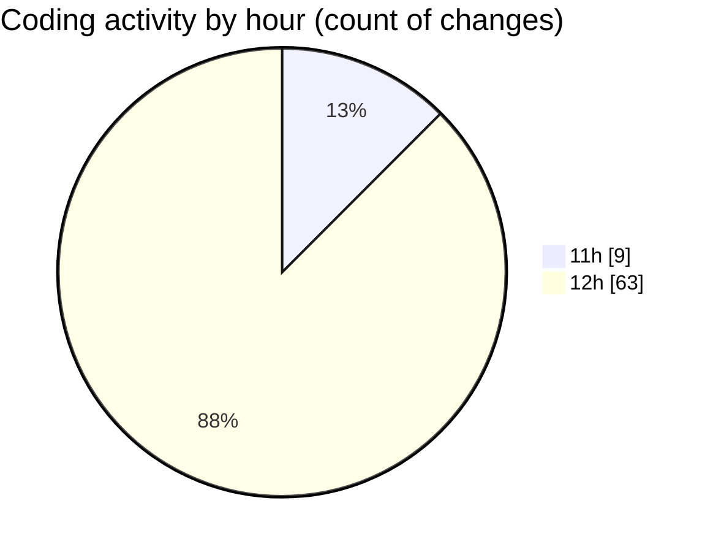

# nxtqube_webapp - Activity Summary 

## Overall Statistics

| Stat                   | Value                                                             |
| ---------------------- | ----------------------------------------------------------------- |
| **Lines Added** (➕)   | 13072                                          |
| **Lines Removed** (➖) | 3751                                        |
| **Net Change** (↕)    | 9321                |
| **Active Time** (⌚)   | 84 minutes |

## Modified Files
- **latitude.icon.tsx** (+39, -0)
- **drone.unbind.dialog.tsx** (+107, -0)
- **longitude.icon.tsx** (+60, -40)
- **drone.info.tsx** (+744, -421)
- **drone.skeleton.tsx** (+68, -44)
- **create.3d.mission.tsx** (+1662, -29)
- **create.grid.mission.tsx** (+510, -30)
- **create.mission.home.tsx** (+351, -179)
- **create.path.mission.tsx** (+936, -15)
- **orbit.mission.control.tsx** (+952, -494)
- **stack.mission.control.tsx** (+1431, -749)
- **mission.controls.tsx** (+817, -416)
- **mission.info.tsx** (+624, -70)
- **waypoint.action.tsx** (+1317, -682)
- **delete.mission.tsx** (+72, -6)
- **mission.slider.tsx** (+132, -4)
- **existing.mission.tsx** (+649, -6)
- **existing.tsx** (+547, -34)
- **manage.mission.tsx** (+240, -43)
- **sort.mission.tsx** (+656, -428)
- **left.half.tsx** (+222, -6)
- **middle.controls.tsx** (+95, -16)
- **detection.filters.tsx** (+146, -6)
- **dock.options.tsx** (+97, -10)
- **manual.controls.tsx** (+417, -16)
- **micro.phone.tsx** (+181, -7)

## Visualizations

### By File Type (Lines Changed)

### By Hour (Estimated Activity Count)

> **Last Updated:** 23/08/2026, 12:52:07