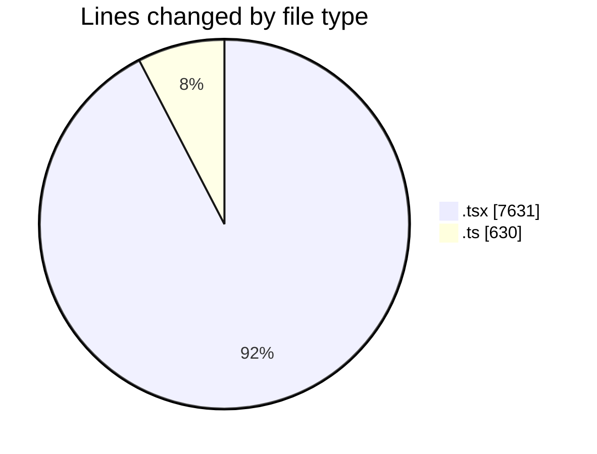
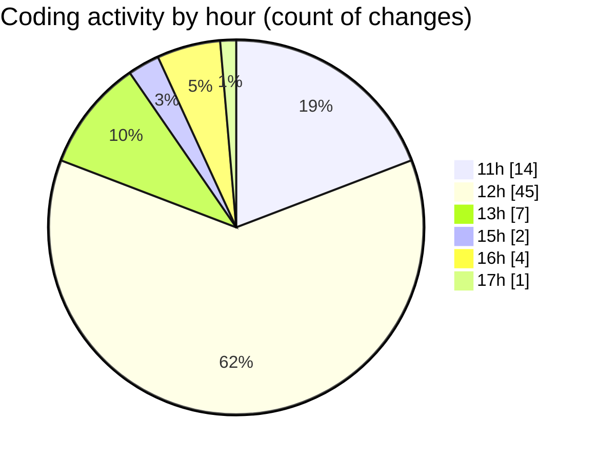

# nxtqube_webapp - Activity Summary 

## Overall Statistics

| Stat                   | Value                                                             |
| ---------------------- | ----------------------------------------------------------------- |
| **Lines Added** (➕)   | 6336                                          |
| **Lines Removed** (➖) | 1925                                        |
| **Net Change** (↕)    | 4411                |
| **Active Time** (⌚)   | 81 minutes |

## Modified Files
- **create.flow.model.tsx** (+127, -2)
- **drone.tsx** (+91, -0)
- **dock.details.panel.tsx** (+2550, -1859)
- **dock.list.tsx** (+157, -6)
- **dock.filter.popover.tsx** (+162, -2)
- **dock.card.tsx** (+196, -0)
- **compass.tsx** (+87, -0)
- **map.controls.tsx** (+73, -35)
- **left.half.tsx** (+235, -19)
- **map.controls.tsx** (+68, -2)
- **users.create.tsx** (+344, -0)
- **forgot.password.tsx** (+131, -0)
- **mission.tsx** (+1269, -0)
- **schedule.mission.tsx** (+216, -0)
- **mission.validator.ts** (+630, -0)

## Visualizations

### By File Type (Lines Changed)

### By Hour (Estimated Activity Count)

> **Last Updated:** 24/08/2026, 17:39:44