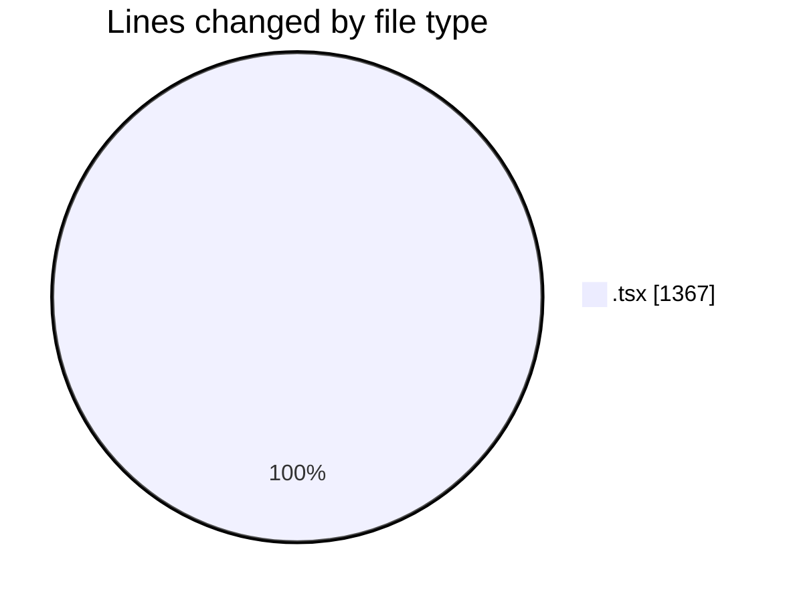
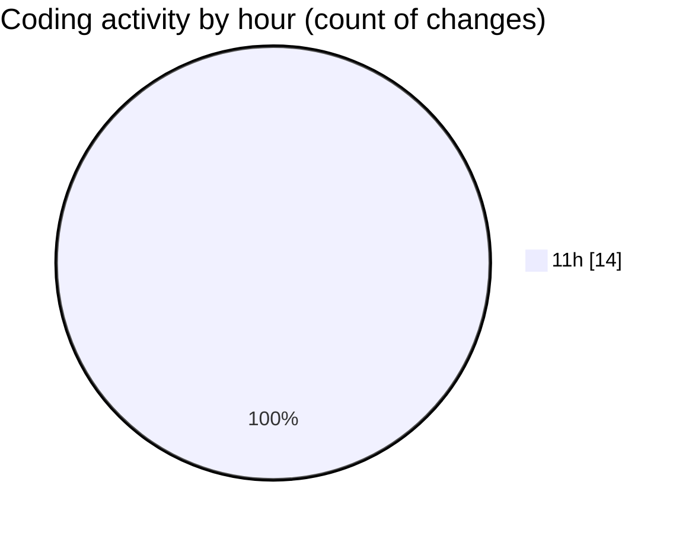

# nxtqube_webapp - Activity Summary 

## Overall Statistics

| Stat                   | Value                                                             |
| ---------------------- | ----------------------------------------------------------------- |
| **Lines Added** (➕)   | 1352                                          |
| **Lines Removed** (➖) | 15                                        |
| **Net Change** (↕)    | 1337                |
| **Active Time** (⌚)   | 12 minutes |

## Modified Files
- **create.flow.model.tsx** (+127, -2)
- **drone.tsx** (+91, -0)
- **dock.details.panel.tsx** (+619, -7)
- **dock.list.tsx** (+157, -6)
- **dock.filter.popover.tsx** (+162, -0)
- **dock.card.tsx** (+196, -0)

## Visualizations

### By File Type (Lines Changed)

### By Hour (Estimated Activity Count)

> **Last Updated:** 24/08/2026, 11:53:11